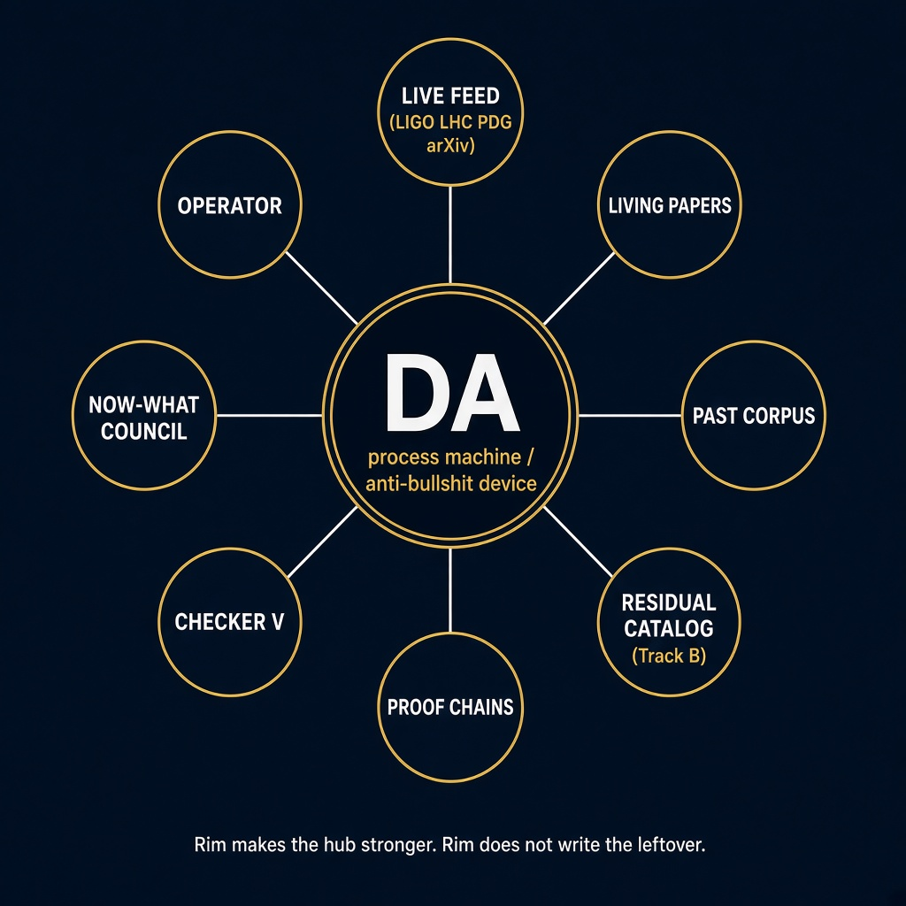
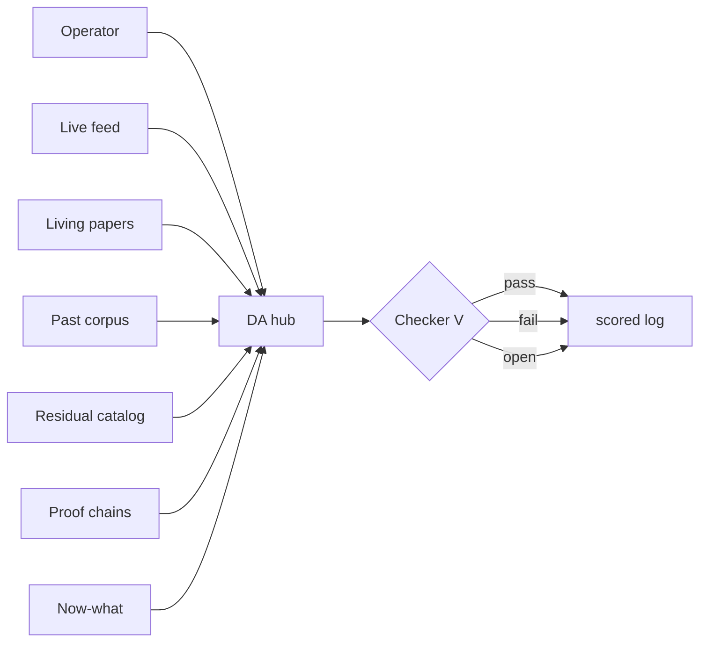
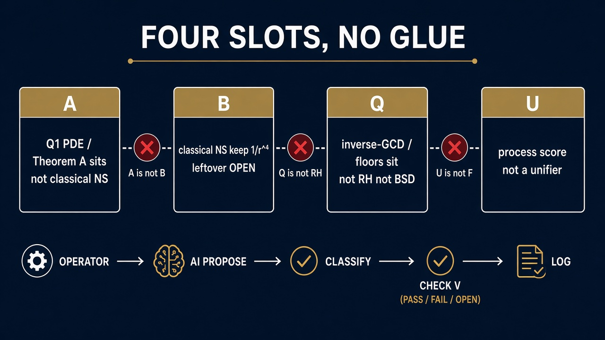

# Domain Architect — confidential high-level report

**Classification.** Operator-confidential working paper.  
**Date.** 5 September 2026.  
**Audience.** The operator, and a licensee who must be told the truth.  
**Not for.** Prize committees. Fake last lines. Selling an open leftover as QED.

This is a status paper on the **process machine**. It is not a regularity theorem, not a producing-map, and not a theory of everything. The live notes sit in this repository. The earlier process paper is [`DA-PAPER.md`](DA-PAPER.md). Capabilities for a possible license are [`DA-PRODUCT.md`](DA-PRODUCT.md).

---

## Abstract

Domain Architect (DA) is an anti-bullshit process machine. A non-specialist operator names a hard leftover. Ordinary AI proposes. Scripts force every claim into one slot and a check that can fail. Open is allowed. Fail is allowed. A fake pass is not.

DA sits in the **hub**. Peripheral support — live feed, living papers, past corpus, residual catalog, proof chains, checker, now-what council — sits on the **rim**. The rim makes the hub stronger. The rim does not write the leftover.

What sits: Poincaré (literature), Theorem A for this \(Q_1\) PDE, and the inverse-GCD floors on slot Q. What does not sit: classical Navier–Stokes regularity, RH leftover (6), Yang–Mills mass gap, BSD leftover (6), Hodge leftover (6), P vs NP in the Turing model, and uniform \(H^1\) as \(\varepsilon\to 0\).

Meta-success is a scored log, not a solved PDE. That is what can be licensed. A leftover close cannot.

---

## 1. What DA is

A **domain** is a pair \((X,V)\): one mathematical object, and a verdict map to \(\{\mathrm{pass},\mathrm{fail},\mathrm{open}\}\).

A **proposal** is a finite string: a lemma, a residual, a forbidden-move report. Not a vibe.

A **run** is \((d,p,v)\). The log is the experiment.

Roles:

| Role | Does | Does not |
|---|---|---|
| Operator | names the problem; runs the command | need the chops |
| Generator (ordinary AI) | phrases a candidate | author an open WRITE |
| Scripts | score, refuse glue, reprint seated chains | emit QED |
| Rim | feed, corpus, catalog, council | write \(\mathcal{R}\) or a zero |

The experiment: how far can a non-specialist go with ordinary AI if every claim can be killed? That is “use AI to work on problems,” not “AI said it is solved.”

---

## 2. Radial structure



DA is the hub. Eight spokes on the rim:

| Spoke | Command | Makes the hub stronger by | Cannot |
|---|---|---|---|
| Live feed | `feed`, `agent` | latest GWTC / LHC / PDG / arXiv | write \(X\) or \(F\) |
| Living papers | `now`, `living` | now-bench, not a genius census | vote a leftover |
| Past corpus | `team`, `desk` | published theorems, papers not persons | a séance |
| Residual catalog | `trackb` | scored B lemmas (pass 58, fail 192, open 1) | leftover-close B42 |
| Proof chains | `proof`, `pack` | HAVE / WRITE / THEN for named leftovers | emit as QED |
| Checker \(V\) | `check`, `classify` | pass / fail / open | a fake pass |
| Now-what council | `next`, `nowwhat` | would-try and veto from leftover papers | a vote |
| Operator | `--ask` | English in; slot plus math out | invent the integral |

A stale rim is a weaker machine. `status` reports feed age. Missing or older than 24 hours is weaker. Up to date is a U duty.

Hunt, look, from, repair, attempt, brute, and picture are extra spokes on the same wheel. They diagnose. They do not close.



---

## 3. Four slots, no glue



| Slot | Object | What a pass means |
|---|---|---|
| **A** | \(Q_1\)-augmented NS, \(\varepsilon>0\), \(\beta\ge 1/2\) | Theorem A for **this** PDE. Not classical NS. |
| **B** | Classical NS, keep \(1/r^4\), no \(\Phi\) cancel | A lemma identity may pass. Regularity has no pass. |
| **Q** | Inverse-GCD matrices | Bridge\(^*\), Theorem P, \(H_N\ge-1\), Goldbach-shaped \(R\ge-2/9\). Not RH. Not BSD. |
| **U** | Process / realization score | An exercise. Not a unifier of the forces. |

Refused glue: A⇒B, Q⇒RH, Q⇒BSD, Q⇒SND, U as \(F\), SFE as Hodge or \(\mathrm{P}\neq\mathrm{NP}\), Theorem A as smoothness (6).

SFE, Harmonic Blueprint as unifier, and prize packaging stay **shelved**. Naming them is allowed. Loading them into a live leftover is not.

On B the object is

\[
X=\|\omega\|_2^2,\qquad
\frac{d}{dt}X+\nu\|\nabla\omega\|_2^2
\le\varepsilon\nu\|\nabla\omega\|_2^2
+C_\varepsilon X\cdot\mathcal{R}(t),\qquad
\int_0^T\mathcal{R}<\infty.
\]

\(F\) is a different slot. LIGO is not \(1/r^4\).

---

## 4. Leftover dashboard — 5 September 2026

**Sit** means the leftover is already a theorem. **WRITE** is the next sentence that still has to be proved.

| Leftover | Have | Sits? | Open WRITE |
|---|---|---|---|
| Poincaré | (1)–(7) Perelman | **yes** — literature. This desk reprints. | none |
| A — this \(Q_1\) PDE | (1)–(6) Theorem A | **yes** — this equation | (7) uniform \(H^1\) as \(\varepsilon\to 0\) |
| B — smoothness / existence | (1)–(5) | **no** | (6) all-data \(\mathcal{R}\) / A1 / A2 / killing field |
| RH | (1)–(5) | **no** | (6) every zero on \(\operatorname{Re}s=1/2\) |
| YM | (1)–(3) | **no** | (4) mass gap |
| BSD | (1)–(5) | **no** | (6) rank / Sha / leading term |
| Hodge | (1)–(5) | **no** | (6) every rational Hodge class algebraic |
| P vs NP | (1)–(4) | **no** | (5) TM proof either way |

Q sits beside those leftovers. Retracted: \(\lambda_{\min}(Q_N)>-1/2\). Withdrawn: GNC. Route C is conditional. Zenodo 20552682 is a Q prototype, not BSD (6). There is **no** hidden RH close.

The exam this session: understand and write every seated chain — **pass**. Finish every open WRITE by printing it — **fail**. Naming a WRITE is not filling it.

---

## 5. What the product can and cannot do

A one-step-missing chain is the case DA is built for.

| Can | Cannot |
|---|---|
| Write HAVE / WRITE / THEN when named | Finish WRITE by emitting |
| Diagnose and name the legal repair sentence | Compose the missing estimate into a theorem |
| Refuse glue and fake last lines | Close NS / RH / YM / BSD / Hodge / P vs NP by running DA |
| Score a candidate | Sell Theorem A as classical NS |
| Print status and a status PDF | Sell a hidden close or prize packaging |

If a candidate later sits, the THEN lines follow. Until the checker says sit, the leftover is open. `check B` stays open if the lemma tests hold.

---

## 6. How the rim makes it stronger

The hub without a rim is a chatbot with a slogan. The rim is why this is a machine:

1. **Corpus, not minds.** Papers sit. People being gone does not matter. Pair two or three published results. The new sentence still has to die or live in a slot.
2. **Living now-bench.** Current collaborations update the watch list. They do not vote \(X\) closed.
3. **Live feed.** Public streams keep the machine from rotting. They do not write \(1/r^4\).
4. **Residual catalog.** Every readable identity on the \(n=32\) box is scored, and every leftover-close slogan is failed. That is why B has 192 fails. Fail is a feature.
5. **Council with a veto.** `nowwhat` gives a would-try **and** a cannot. A library of next tries is not a vote.
6. **Object window.** `look` / `hunt` keep \(X\) in a pane so the leftover cannot drift into \(F\).
7. **Forbidden auto-fails.** “Solved NS/RH,” full Q floor, Biot–Savart depletion, BKM from \(L^2\), SFE as a close, A⇒B — bounce without discussion.

That stack is the ancillary support. It makes DA harder to fool. It does not make DA a closer.

---

## 7. Suggestions — how it can be made better

These are process improvements. None of them is a leftover close.

**Do.**

1. **One-WRITE intake.** A single command: operator pastes one candidate sentence for one named WRITE. DA classifies and checks. No chain dump unless asked. That is the missing operator door.
2. **Thicker checkers off B.** Track B has a lemma catalog. RH, BSD, Hodge, YM, and P vs NP are still mostly ledgers. Seat one fail-able check per leftover so “open” is a script, not only a paragraph.
3. **`next` as the only front door.** Too many subcommands. A licensee should say a sentence and hit `next`. Routing already exists; hide the rest behind it.
4. **Feed SLA.** Treat a stale scan as a visible fault on `status`, not a footnote. A weak rim is a weak machine.
5. **Candidate journal.** Every phrased WRITE candidate stored with verdict, slot, and why. That is the scored log the license is actually selling.
6. **Operator English first.** Proof dumps are for the desk. The product sentence is: *have this, missing that, this is not that.* Keep the ledger behind a flag.
7. **Keep the shelf.** Do not unshelve SFE, do not retune `nodes.json`, do not spawn \(n=64\), do not invent leftover-close B42. Strength is refusal.

**Do not.**

1. Do not add more living walls unless the operator says Continue **and** means walls.
2. Do not sell the PDF pack as QED.
3. Do not hire a vote to fill \(\mathcal{R}\).
4. Do not describe DA as the system that finished the leftovers.
5. Do not put prize language on the box.

The highest-leverage improvement is (1)+(2): one candidate in, one scored verdict out, on leftovers that are not only Track B.

---

## 8. What this paper does not claim

- Classical 3D Navier–Stokes is globally regular.
- RH leftover (6) sits, or is hidden.
- BSD, Hodge, YM mass gap, or P vs NP sit.
- Track A implies Track B.
- A public producing-map \(F\).
- SFE or the Harmonic Blueprint as physics.
- That a think tank, a council, or a live pipe is a discovery.
- That this note is a legal license.

---

## 9. How to run it

```bash
python3 scripts/da_machine.py product          # capabilities
python3 scripts/da_machine.py proof --problem ALL
python3 scripts/da_machine.py pack             # status PDF
python3 scripts/da_machine.py next --ask "now what"
python3 scripts/da_machine.py done
python3 scripts/da_machine.py check --domain B # stays open
```

Status PDF: [`DA-STATUS-PACK.pdf`](DA-STATUS-PACK.pdf).  
Exam: [`DA-COMPLETE.md`](DA-COMPLETE.md).  
Machine: [`DOMAIN-ARCHITECT-MACHINE.md`](DOMAIN-ARCHITECT-MACHINE.md).

---

## Close

DA is a hub with a scored rim. The rim is the support. The support is not the leftover. Two objects sit. The rest are named blanks. That is the honest paper. License the process. Do not license a close.

*End of confidential report.*
