# NS tree — dead vs living

14 September 2026.
This is a map of **this program’s** Navier–Stokes objects.
It is not a theorem. Ordinary unaugmented NS stays **open**.
Soft X silent.

**How to read**

| Mark | Meaning |
|---|---|
| **KEEP** | Standard tool. Not a close. |
| **DEAD** | Do not rebuild. Named kill or withdrawal. |
| **CLAIMED** | Written argument; internal checks; independent specialist pending. |
| **OPEN** | Living leftover. Not a hidden yes. |
| **OTHER PDE** | Different equation. Do not glue onto ordinary NS. |

Living means the branch still has a question or a tool.
It does not mean proved.

---

## If another Cursor says DEAD

That is usually a **name collision**, not a named kill of the gold node.

The word **9D** has been used for two different objects.
Do not glue them.

| Object | Word on this tree | Typical desktop / PR #80 sentence |
|---|---|---|
| Designed \(\Theta(m^2)\) 9D; Freiman-AP; fixed-\(s\) \(\Theta(m^2)\) with \(K\le 16s\); grow-\(s\) as \(C_0\) | **DEAD** | “9D is dead.” “No 9D claim.” “Team already had growing-\(s\).” |
| Exact-shell as a **close** of unrestricted \(\star\) or of ordinary NS | **DEAD as a close** | “9D does not solve NS.” “A true \(4/3\) does not continue.” |
| Exact-shell one-input-shell bound \(K\le 16/9\) | **CLAIMED** | This is the other object. Desktop is **not** contradicting the red nodes by calling the old 9D dead. |

PR [#80](https://github.com/simons357/Ship_it_app/pull/80) locks the **first** object: no claim on that kill-lane; grow-\(s\) remains a sweep, not \(C_0\).
This tree agrees with that lock.

This PR locks the **third** object: a written one-shell bilinear bound, claimed, not proved, not a close.

**Do not reconcile by unclaiming \(16/9\)** unless a failing line is named
(kernel, factor \(3\), half-symmetrization, or Hermitian residual).
**Do not reconcile by upgrading CLAIMED to proved.**
A desktop “dead” with no named algebraic error is a verdict on the old 9D, or on 9D-as-close, not on the gold node.

If desktop **did** name a failing line in the \(16/9\) algebra, paste that line.
Then this gold node moves to DEAD. Until then it stays CLAIMED.

```mermaid
flowchart TD
  root["Unaugmented NS on T³<br/>ordinary regularity: OPEN"]

  tools["KEEP tools<br/>Leray energy · enstrophy identity<br/>LP shells · Bony split · stretching"]
  trackA["OTHER PDE<br/>Q1-augmented / extra-stress<br/>not ordinary NS"]
  swirl["KEEP algebra, OPEN as regularity<br/>Γ = r u_θ, identity only<br/>do not feed into a close"]
  star["Unrestricted ★<br/>boxed instantaneous R★"]
  shell["Exact-shell 9D<br/>one input shell, occupancy s"]
  h1["H1 / WRITE<br/>other integral"]
  ax["Axisymmetric shell remainder<br/>T_j←j"]
  replace["Replacement energy-budget closure"]

  root --> tools
  root --> trackA
  root --> swirl
  root --> star
  root --> shell
  root --> h1
  root --> ax
  root --> replace

  star --> vn["DEAD as that box<br/>v_n growing-layer family<br/>instantaneous class, not a trajectory"]
  star --> need["DEAD as repair of the same box<br/>Need★ cannot revive unrestricted ★"]
  star --> tc["OPEN: all-n T_c identity<br/>evaluators n=1..10, not a general-n hand check"]

  shell --> designed["DEAD: designed Θ(m²) 9D"]
  shell --> grows["DEAD as C0: grow-s / 0.456 / 0.641"]
  shell --> kbound["CLAIMED: K ≤ 16/9<br/>occupancy s gone on one shell if it holds"]
  shell --> threeshear["KEEP example: K_{1,2}=2/3<br/>w = (sin y, sin z, sin x)"]
  shell --> notclose["DEAD as a close<br/>true 4/3 does not continue,<br/>does not repair ★, does not control several shells"]

  h1 --> h1open["OPEN as leftover<br/>YES as a write, NO as a theorem"]
  ax --> axopen["OPEN remainder"]
  replace --> repopen["OPEN leftover after ★ died"]

  style root fill:#fff,stroke:#333
  style vn fill:#f4d7d7,stroke:#8a3a3a
  style need fill:#f4d7d7,stroke:#8a3a3a
  style designed fill:#f4d7d7,stroke:#8a3a3a
  style grows fill:#f4d7d7,stroke:#8a3a3a
  style notclose fill:#f4d7d7,stroke:#8a3a3a
  style kbound fill:#f7ecc6,stroke:#8a6a12
  style tc fill:#d9ead3,stroke:#3d6b2e
  style h1open fill:#d9ead3,stroke:#3d6b2e
  style axopen fill:#d9ead3,stroke:#3d6b2e
  style repopen fill:#d9ead3,stroke:#3d6b2e
  style tools fill:#e6e6e6,stroke:#555
  style threeshear fill:#e6e6e6,stroke:#555
  style trackA fill:#dde4f0,stroke:#355
  style swirl fill:#e6e6e6,stroke:#555
```

Red = dead. Gold = claimed. Green = open leftover. Grey = tool or example. Blue = other equation.

---

## Dead (do not rebuild)

| Branch | Why it is dead |
|---|---|
| Unrestricted \(\star\) as \(\sup\mathcal R_\star<\infty\) | \(v_n\) is an admissible instantaneous family with \(\mathcal R_\star\to\infty\), **if** the all-\(n\) \(T_c\) identity stands |
| Need★ as a repair of that same box | Different hypotheses would be a different claim |
| Designed \(\Theta(m^2)\) 9D | Freiman / AP obstruction. Script was not written |
| Grow-\(s\) or \(0.641\) / \(0.456\) as \(C_0\) | Finite samples. Not a ceiling |
| Exact-shell \(4/3\) as regularity close | No continuation. No multi-shell control. Does not repair \(\star\) |
| Glue to swirl \(\Phi\)-cancel, H1, or the axisymmetric door | Other integrals |

The \(T_c(v_n)\) identity is **not** dead. It is the load-bearing line of the \(\star\) kill and is still pending a general-\(n\) hand check.

---

## Claimed (living as a claim only)

Exact-shell, one input shell, \(Aw=\alpha w\):

\[
\|\Pi_\beta B(w,w)\|_2
\le
\frac43\frac{\alpha}{\sqrt{\beta}}\|w\|_2^2,
\qquad
K_{\alpha,\beta}(w)\le\frac{16}{9}.
\]

Occupancy \(s\) is gone on that subclass **if** this holds.
Internal audit: no gap found by the author. Independent specialist: pending.
Pages: [`ATTACK-9D-FULL-SUPPORT-BOUND.md`](ATTACK-9D-FULL-SUPPORT-BOUND.md),
[`ATTACK-9D-SPECIALIST-QUESTIONS.md`](ATTACK-9D-SPECIALIST-QUESTIONS.md).

---

## Open leftovers (living questions)

| Leftover | What would move it |
|---|---|
| Ordinary unaugmented regularity | A continuation or a priori that actually applies to all data |
| All-\(n\) \(T_c(v_n)\) | A hand identity for every \(n\ge 1\), or a named failing line |
| Replacement energy-budget closure | A **different** estimate after unrestricted \(\star\) died |
| H1 / WRITE | A theorem, not a write |
| Axisymmetric remainder \(T_{j\leftarrow j}\) | A class bound, or a field that blows it |

A finite superposition of exact-shell fields with a \(C\) that depends only on the number of shells would be a **new** theorem. It is not on this tree as claimed.

---

## Other books (not branches of this tree)

- Track A extra-stress PDE: other equation.
- Inverse-GCD / arithmetic floors: other book.
- Experiment 01 ringdown: closed null, not NS.

Do not draw an arrow from those into ordinary NS.

---

## One-line status

Tools live. Unrestricted \(\star\) dead as a box. Designed 9D dead. Exact-shell \(16/9\) claimed on one shell. Ordinary NS open.

Desktop “9D is dead” agrees with the red 9D nodes. It does not, by itself, kill the gold node.
