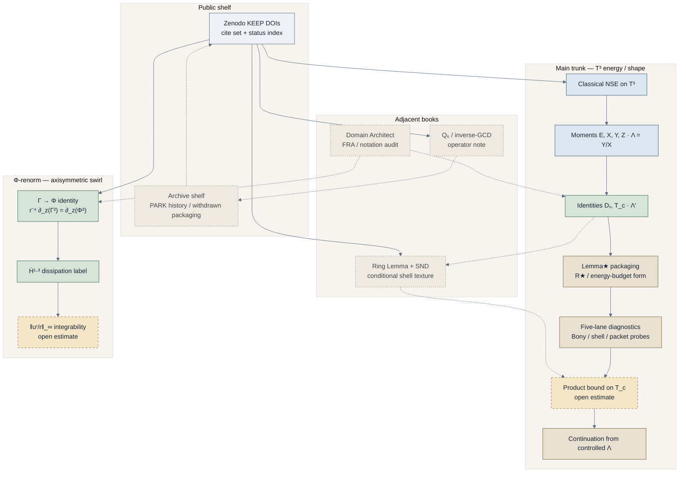

# Proof journey

Click through the body of work. Detail is optional: open a chapter when you want depth; otherwise move on. The chain carries status — not billboards.

**Companion lock:** [`REPUTATION-LOCK.md`](./REPUTATION-LOCK.md)  
**Notation:** [`NOTATION-GLOSSARY.md`](./NOTATION-GLOSSARY.md)  
**Clean math face:** [`../ns-review/PROOF-CHAIN-CLEAN.md`](../ns-review/PROOF-CHAIN-CLEAN.md)  
**Visual pack:** [`../ns-review/visual-journey/`](../ns-review/visual-journey/) · mirror [`visual-journey/`](./visual-journey/)

---

## First click (Monday)

Start here: **[`../ns-review/visual-journey/figures/proof-chain.png`](../ns-review/visual-journey/figures/proof-chain.png)** — one composition, the whole packaging chain. Open estimates are dashed and labeled as math objects. Then the **barycenter** figure [`../ns-review/visual-journey/assets/lemma-star-barycenter.png`](../ns-review/visual-journey/assets/lemma-star-barycenter.png) for “we are there” energy as a **locus in the construction**, not a prize stamp.

---

## How to read

| Cue | Meaning |
| --- | --- |
| Solid cool node | Classical setting or definition |
| Solid green node | Identity / KEEP algebra |
| Solid warm node | Packaging / continuation arrow |
| Dashed warm node | **Open estimate** — named as the analytic object still needed |
| Muted dashed node | Optional / conditional texture |

Experts see what stands and what is open from the chain itself. Campaign pages do not stamp “solved” or “unsolved.”

---

## Body-of-work chain

Canonical rendered map (trunk + Φ + SND): [`../ns-review/visual-journey/figures/proof-chain.png`](../ns-review/visual-journey/figures/proof-chain.png) · Mermaid source [`../ns-review/visual-journey/proof-chain.mmd`](../ns-review/visual-journey/proof-chain.mmd). Full body-of-work Mermaid also lives in [`journey-chain.mmd`](./journey-chain.mmd).

---

## Chapters

Click any chapter. Skip what you do not need.

### 1 — Classical substrate & clean math

- [`../ns-review/PROOF-CHAIN-CLEAN.md`](../ns-review/PROOF-CHAIN-CLEAN.md) — definitions of \(E,X,Y,Z,\Lambda,D_s,T_c\); Lemma★; product needs
- [`NOTATION-GLOSSARY.md`](./NOTATION-GLOSSARY.md) — symbol card + collision warnings
- Math cleanup pointers: Φ dissipation relabel \(\dot H^{2.6}\to\dot H^{1.3}\); open nodes named as estimates, not scarlet letters

### 2 — Lemma★ (shape packaging)

- Clean statement: §4 of [`PROOF-CHAIN-CLEAN.md`](../ns-review/PROOF-CHAIN-CLEAN.md)
- Barycenter visual: [`../ns-review/visual-journey/assets/lemma-star-barycenter.png`](../ns-review/visual-journey/assets/lemma-star-barycenter.png)
- Stretch vs spread: [`../ns-review/visual-journey/assets/03-tug-of-war-stretch-vs-spread.png`](../ns-review/visual-journey/assets/03-tug-of-war-stretch-vs-spread.png)
- Captions: [`../ns-review/visual-journey/CAPTIONS.md`](../ns-review/visual-journey/CAPTIONS.md)

Shape form (schematic):

\[
\mathcal{R}_\star(v)=\frac{\bigl(T_c(v)_+\bigr)^2}{D_s(v)\,E\,Y},\qquad
\sup_v\mathcal{R}_\star(v)<\infty
\quad\text{(geometric packaging)}.
\]

### 3 — Five-lane diagnostics

Probe lanes that stress the packaging — Bony high×high input channel, shell / packet diagnostics, exact-shell \(K\) probes. Repo home:

- [`../ns-review/five-lane-recovery/`](../ns-review/five-lane-recovery/) — scripts + tests recovered for lane probes
- Product hinge (open estimate): §5 of [`PROOF-CHAIN-CLEAN.md`](../ns-review/PROOF-CHAIN-CLEAN.md)

These lanes **diagnose**; they do not replace the product bound on \(T_c\).

### 4 — Φ-renorm (axisymmetric swirl)

- KEEP / PARK card: [`../ns-review/PHI-RENORM-WHAT-IS-KEPT.md`](../ns-review/PHI-RENORM-WHAT-IS-KEPT.md)
- Aug 22 audit: [`../ns-review/PHI-RENORM-AUDIT-2026-08-22.md`](../ns-review/PHI-RENORM-AUDIT-2026-08-22.md)
- TeX faces: [`../papers/swirl/`](../papers/swirl/) · [`../papers/phi-renorm/`](../papers/phi-renorm/)
- KEEP algebra DOIs: [`10.5281/zenodo.22050974`](https://doi.org/10.5281/zenodo.22050974), [`10.5281/zenodo.22050975`](https://doi.org/10.5281/zenodo.22050975)
- Conditional June 30 deposit: [`10.5281/zenodo.21071991`](https://doi.org/10.5281/zenodo.21071991)

Open estimate on this branch: uniform control of \(\|u^r/r\|_{L^\infty}\). Separate book from Lemma★ — do not glue.

### 5 — SND / Ring Lemma (conditional texture)

- KEEP: [`10.5281/zenodo.22050976`](https://doi.org/10.5281/zenodo.22050976) — Ring Lemma + SND **conditional**
- T2 under SND: [`10.5281/zenodo.22050965`](https://doi.org/10.5281/zenodo.22050965)
- Visual atmosphere: triad ring / nested shells in [`../ns-review/visual-journey/assets/`](../ns-review/visual-journey/assets/)

Optional side texture on the map — not a substitute for the product estimate on the main trunk.

### 6 — Q6 (inverse-GCD operator)

- KEEP: [`10.5281/zenodo.22050962`](https://doi.org/10.5281/zenodo.22050962) — operator note; exploratory spectral programme
- Route C exploratory: [`10.5281/zenodo.22050963`](https://doi.org/10.5281/zenodo.22050963)

Adjacent arithmetic book. No Millennium glue from this chapter into the NS trunk.

### 7 — Domain Architect (DA)

- [`../domain-architect/README.md`](../domain-architect/README.md)
- Baseline → inventory → conflicts → reconciliation → notation collisions → rectification: [`00`](../domain-architect/00-AUDITED-BASELINE.md) · [`01`](../domain-architect/01-EQUATION-INVENTORY.md) · [`02`](../domain-architect/02-CONFLICT-TABLE.md) · [`03`](../domain-architect/03-RECONCILIATION.md) · [`04`](../domain-architect/04-NOTATION-COLLISIONS.md) · [`05`](../domain-architect/05-RECTIFICATION.md)

Auditing and notation hygiene for the shelf — not a substitute proof.

### 8 — Zenodo KEEP DOIs

Cite set (settled dispositions in [`../../data/zenodo/deposit_metadata.json`](../../data/zenodo/deposit_metadata.json)):

| DOI | Role |
| --- | --- |
| [`10.5281/zenodo.22050978`](https://doi.org/10.5281/zenodo.22050978) | Status / correction index |
| [`10.5281/zenodo.22050974`](https://doi.org/10.5281/zenodo.22050974) / [`075`](https://doi.org/10.5281/zenodo.22050975) | Φ-renorm algebra |
| [`10.5281/zenodo.21071991`](https://doi.org/10.5281/zenodo.21071991) | PhiRenorm June 30 conditional |
| [`10.5281/zenodo.22050976`](https://doi.org/10.5281/zenodo.22050976) | Ring + SND conditional |
| [`10.5281/zenodo.22050965`](https://doi.org/10.5281/zenodo.22050965) | T2 under SND |
| [`10.5281/zenodo.22050962`](https://doi.org/10.5281/zenodo.22050962) | Q6 operator |
| [`10.5281/zenodo.22050963`](https://doi.org/10.5281/zenodo.22050963) | Route C exploratory |

Inventory correction notes: [`../zenodo/INVENTORY-CORRECTION-2026.md`](../zenodo/INVENTORY-CORRECTION-2026.md).

### 9 — Archive shelf (PARK)

History only — superseded concepts, withdrawn Millennium packaging, soft pointers under KEEP successors. See `PARK_ARCHIVE` rows in [`deposit_metadata.json`](../../data/zenodo/deposit_metadata.json) and the PARK section of the inventory correction note. Cite KEEP; open archive when reconstructing how a claim was retired.

---

## Math cleanup pointers

1. Prefer KEEP Φ-algebra DOIs (`22050974` / `22050975`) over uncleaned \(\dot H^{2.6}\) wording on older TeX faces.
2. On the Φ branch, dissipation is \(\dot H^{1.3}\) after operator-composition relabel (audit 22 Aug 2026).
3. Label open analytic needs as the **object** (\(\lvert T_c\rvert\) product bound; \(\|u^r/r\|_\infty\); SND hypothesis) — never as FAILED / ERRATA banners on the journey face.
4. Do not reuse FRA output \(\Phi\) for swirl \(\Phi\); do not identify \(T_c\) with shell flux \(J\).
5. Full glossary: [`NOTATION-GLOSSARY.md`](./NOTATION-GLOSSARY.md).

---

## Tone

Craftsman. Completeness + clarity. Barycenter = where the shape construction lives. No cast-list biography framing on campaign pages. Reputation rules: [`REPUTATION-LOCK.md`](./REPUTATION-LOCK.md).
