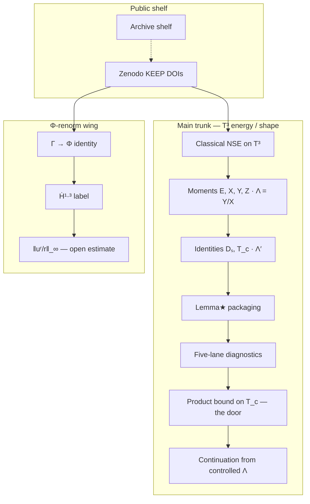

# Proof journey

We broke into the house of Navier–Stokes. He’s not in this room right now — we think we heard someone upstairs. We know where we are: **at the door**, in the spectral **barycenter** room. Here is how the room looks, how it behaves, and how you go through the door. Pictures first. Click for depth. No “solved” stamp.

Longer plain-language face: [`HOUSE-OF-NS.md`](./HOUSE-OF-NS.md)  
**Adult FAQ (what object? blowup? universe?):** [`WHAT-IS-THIS.md`](./WHAT-IS-THIS.md)  
**Companion lock:** [`REPUTATION-LOCK.md`](./REPUTATION-LOCK.md)  
**Notation:** [`NOTATION-GLOSSARY.md`](./NOTATION-GLOSSARY.md)  
**Clean math face:** [`../ns-review/PROOF-CHAIN-CLEAN.md`](../ns-review/PROOF-CHAIN-CLEAN.md)  
**Visual pack:** [`../ns-review/visual-journey/`](../ns-review/visual-journey/) · mirror [`visual-journey/`](./visual-journey/)

---

## First click (Monday)

Start here: **[`../ns-review/visual-journey/figures/proof-chain.png`](../ns-review/visual-journey/figures/proof-chain.png)** — floor plan of the house we’ve mapped. Open estimates are dashed doors labeled as math. Then **this room** — the barycenter — [`../ns-review/visual-journey/assets/lemma-star-barycenter.png`](../ns-review/visual-journey/assets/lemma-star-barycenter.png).

---

## How to read

| Cue | Meaning |
| --- | --- |
| Solid cool node | Classical setting or definition |
| Solid green node | Identity / KEEP algebra |
| Solid warm node | Packaging / continuation arrow |
| Dashed warm node | **Door** — open estimate, named as the analytic object still needed |
| Muted dashed node | Optional / conditional wing |

Experts see what stands and what is open from the chain itself. Campaign pages do not stamp “solved” or “unsolved.”

---

## Body-of-work chain

---

## Chapters (click if you want depth)

1. **Classical setup** — [`../ns-review/PROOF-CHAIN-CLEAN.md`](../ns-review/PROOF-CHAIN-CLEAN.md) §§1–2  
2. **This room — barycenter** — [`HOUSE-OF-NS.md`](./HOUSE-OF-NS.md) + barycenter figure  
3. **Lemma★ packaging** — shape / energy-budget forms (packaging ≠ closed door)  
4. **The door — product bound on \(T_c\)** — [`../ns-review/MONDAY-DOOR-SPRINT.md`](../ns-review/MONDAY-DOOR-SPRINT.md)  
5. **Five-lane diagnostics** — hallway flashlights, not a substitute key  
6. **Φ-renorm wing** — separate barrier \(\|u^r/r\|_\infty\)  
7. **Domain Architect** — structural checker / refuse illegal glue  
8. **KEEP + archive shelves** — cite set; history soft-linked  

---

## Outreach & daily feed

- X / xAI one-shots: [`X-XAI-OUTREACH.md`](./X-XAI-OUTREACH.md)  
- **Daily Substack + Skool:** [`FEED.md`](./FEED.md) · week-1 copy [`FEED-WEEK1.md`](./FEED-WEEK1.md) · log [`FEED-LOG.md`](./FEED-LOG.md)

