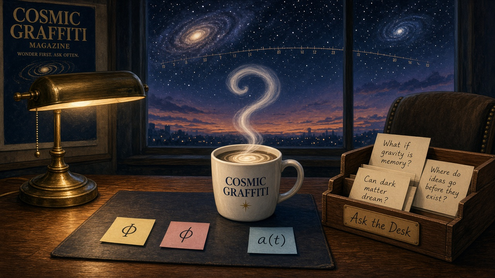

# Ask the Desk

**Cosmic Graffiti** · Q&A tray · 14 September 2026

People can send questions. We explain.

This is one magazine, not a second one. Cosmic Graffiti is the magazine.
The Frequency is the news desk. Ask the Desk is the Q&A tray. **Domain
Architect** is the live lab:

```
DECOMPOSE → CROSS-DOMAIN TRANSLATE → SYNTHESIZE
```

The magazine is the public table. It is not a second physics. Paid
classroom walls and patents remain a **plan**; this repo does not run a
paywall and Domain Architect does not file patents.

This folder is the working magazine copy. Frequency issues, when they
land, live under `issues/`. Incoming notes can drop in
`issues/_trays/letters.md`. **Published answers stay in this file.** Do
not fork a second magazine, and do not revive the old “GRAFITTI”
misspelling.

Live site: [cosmic-graffiti-magazine.vercel.app](https://cosmic-graffiti-magazine.vercel.app/)

---

## How the desk works

Readers send questions however the room already talks:

- a reply on Substack
- a thread in the Skool classroom
- a comment on The Frequency

We answer with wonder and no BS. Math and physics as they sit around us
— coffee, night sky, a letter on a page — named in plain English.

Every answer keeps three labels visible:

| Label | Meaning |
|---|---|
| **Known** | What the craft actually holds. |
| **Open** | What is still unsettled. |
| **Picture** | A drawing to hold in your head. Not a proof. |

We never fake a close. If a story is only a picture, we say so. If two
letters look the same and name different objects, we inventory them
instead of gluing them.

House tone, same as the magazine: wonder first · labels loud · never
mean.

---

## Paste-ready section

Copy from the picture through the five starter answers. Upload
`assets/ask-the-desk.png` beside the post. Leave the empty trays and
the Skool notes in this file for the next round.

### Picture

<p>

</p>

The cream is doing fluid mechanics. The window is doing expansion. The
sticky notes are doing inventory. Same desk. Three jobs. The steam is
allowed to be a question mark.

---

### Starter 1 — Why does cream swirl in coffee?

**Date.** 14 September 2026
**Asker.** Desk (starter)

Pour cold cream into hot coffee and you do not get a beige disk. You get
ribbons, then a spiral, then a cloud. The cream is a **tracer**: a dye
the velocity field is carrying. Stirring stretches the interface into
thin sheets. Those sheets fold. Folded sheets mix faster because there
is more surface for the two liquids to share.

**Known.** The continuum law for that velocity is Navier–Stokes:
momentum accounting for a viscous fluid, plus mass conservation. In a
cup you can see the pieces with your eyes. Hot and cold have slightly
different densities, so buoyancy helps. The spoon adds a swirl. Viscosity
smoothes sharp shear. Molecular diffusion finally finishes the beige.
Engineers, blood-flow people, and weather models run on that same
accounting every day. Two-dimensional versions of the law are in much
better mathematical shape than the three-dimensional one.

**Open.** Whether every smooth three-dimensional start stays smooth is
still an analysis question. Nobody at this desk is announcing that it
is finished. Domain Architect keeps a Navier–Stokes challenge on the
board as a **challenge, not a pass**. The cup does not care. The cup
already mixed.

**Picture.** The cream is a tourist riding the velocity. Navier–Stokes
is the street map of that ride. A street map is not the claim that
every possible city has been walked.

---

### Starter 2 — What is a prime, and why do people care?

**Date.** 14 September 2026
**Asker.** Desk (starter)

A **prime** is an integer greater than 1 whose only positive divisors
are 1 and itself: 2, 3, 5, 7, 11, …. Composite numbers factor into
primes. That is the craft’s first hard-won fact: unique factorization.
Primes are the multiplicative atoms of the integers. They are not a
unification myth, and they are not a secret engine of fluids.

**Known.** People care because the atoms are useful. Cryptography that
sits on your phone uses the hardness of factoring large composites.
The prime-number theorem says the density of primes near \(n\) is about
\(1/\ln n\): they thin out, in a law you can state. Sieves, modular
arithmetic, and zeta-type generating functions are tools of the trade.
Number theory is a craft with theorems, computations, and unfinished
business. It does not need to swallow the rest of physics to be worth
doing.

**Open.** Fine distribution questions about primes remain a living
research area. Patterns you can plot on a napkin are not the same as
theorems. We do not promote a prime-sine story into a law of nature
from this tray.

**Picture.** A prime is a brick that will not split in multiplication.
Bricklaying is a craft. It is not a theory of the whole house, and it
is not a theory of the coffee in Starter 1.

---

### Starter 3 — Is the night sky static?

**Date.** 14 September 2026
**Asker.** Desk (starter)

No. The sky over your town tonight is not a frozen photograph, and the
large-scale universe is not one either.

**Known.** Stars have proper motion. Planets wander. Satellites crawl.
On cosmological scales, distances between distant galaxies grow. The
usual name for that growth is the **scale factor** \(a(t)\): when \(a\)
doubles, those large-scale distances double. That is expansion. It is
ordinary observational cosmology. It does **not** need a breathing
field, and it is **not** SFE breathing \(\Phi\). Do not glue \(a(t)\)
to that sine-sum picture. The sine-sum picture is not how this desk
claims the cosmos works.

**Open.** That the expansion has been speeding up is a measured fact
with a name — dark energy — and a much thinner story about *what* the
name is. We leave that gap visible. Filling it with “so the universe
breathes \(\Phi\)” would be a fake close.

**Picture.** Look at the window in the desk drawing: two galaxies and a
measuring tape of light between them. The tape is \(a(t)\). It is not
the coffee swirl, and it is not a sticky note labeled \(\Phi\).

---

### Starter 4 — Same letter, different object: why does Φ keep showing up?

**Date.** 14 September 2026
**Asker.** Desk (starter)

Because the Greek alphabet is short, and several honest crafts needed a
symbol. The collision is in the typecase, not in the physics. We inventory.
We do not wink at you for noticing.

| Glyph | Object | Book |
|---|---|---|
| \(\Phi = u_\theta/r\) | Axisymmetric **swirl** (azimuthal speed over radius) | Fluids / Book B. A kinematic field in a spinning flow. |
| \(\Phi\) | A **potential** (gravity, electrostatics, or another scalar whose gradient is the force) | Classical physics. Different job from swirl. |
| \(\Phi\) | **Realized output** in Domain Architect / functional-role notes | The lab’s “what came out.” Not swirl. Not golden-ratio. |
| \(\varphi = (1+\sqrt{5})/2\) | **Golden ratio** | A number. Lower-case on purpose when we can. Not a fluid. Not expansion. |
| \(a(t)\) | Cosmological **scale factor** | Expansion. Not any of the \(\Phi\)s above. |

**Known.** Each row is real in its own book. Swirl \(\Phi = u_\theta/r\)
is how some papers talk about spinning axisymmetric flow. A gravitational
potential named \(\Phi\) is how first-year mechanics talks about mass.
Golden-ratio \(\varphi\) is a quadratic irrational that shows up in
Fibonacci limits and some geometry. Same ink. Different objects.

**Open.** None of these identifications is “unfinished math” in the sense
of Starter 1. The unfinished work is **keeping them apart** when a
paragraph gets excited. Do not glue swirl \(\Phi\), potential \(\Phi\),
DA output \(\Phi\), golden-ratio \(\varphi\), or expansion \(a(t)\). Do
not glue them to other colliding letters in the archive (\(Q_6\),
\(H_N\), and friends). Same letter is not a proof of sameness.

**Picture.** The blotter in the drawing: three sticky notes, physically
separated. That *is* the method.

---

### Starter 5 — What is Domain Architect?

**Date.** 14 September 2026
**Asker.** Desk (starter)

**Domain Architect** is the live product. Cosmic Graffiti is not.

The lab does three verbs:

```
DECOMPOSE → CROSS-DOMAIN TRANSLATE → SYNTHESIZE
```

**Known.** Systems from different domains can be physically unrelated
and still carry mathematical structures that play corresponding **roles**
(select, couple, transport, dissipate, constrain). Domain Architect
tests which structures survive translation and assembles compatible
pieces into candidate architectures. Correspondence is a **hypothesis**,
not physical equivalence. The desktop app and the `domain_architect`
package in this repo are that lab. Turbulence reduction is a **program**
under DA (ships active; other vehicles queued). It sits on top of
continuum fluid law. It does not replace the law, and it does not turn
the magazine into a solver.

**Open.** A translated role can fail. A leftover can stay leftover. The
lab is built to keep those doors labeled. Ask the Desk will not pretend
a magazine paragraph closed one.

**Picture.** DA is the workshop in the back. Cosmic Graffiti is the
table out front where we talk. The Frequency is the news rail on that
table. Ask the Desk is the inbox. Four pieces. One house.

---

## Tray for Jon

Drop your own questions here. Copy a blank card. Date them. Initials
are enough; “Anonymous” is fine. Write the answer in the same three
labels, or leave the answer empty for the next sitting.

### Card — YYYY-MM-DD · Asker: J.S. (or Anonymous)

**Q.**

**Known.**

**Open.**

**Picture.**

### Card — YYYY-MM-DD · Asker:

**Q.**

**Known.**

**Open.**

**Picture.**

---

## Tray for readers

Future mail. Same shape. Paste the incoming wording; do not clean it
into a better question than they asked. If you do not know, say so.

### Card — YYYY-MM-DD · Asker: (initials or Anonymous)

**Q.**

**Known.**

**Open.**

**Picture.**

### Card — YYYY-MM-DD · Asker: (initials or Anonymous)

**Q.**

**Known.**

**Open.**

**Picture.**

---

## How Jon adds a question later

1. Leave this file where it is: `docs/cosmic-graffiti/ask-the-desk.md`.
   Do not start a second magazine folder.
2. If the note is still raw mail, you can park it in
   `issues/_trays/letters.md`. When you answer it, copy a blank card
   in **Tray for Jon** or **Tray for readers** and write the three
   labels here.
3. Keep the three labels. If a close is not in hand, the Open line
   stays Open.
4. Paste the new card into Substack or the Skool thread. Upload a
   picture if you have one; the desk drawing can ride along.
5. The Frequency can blurb that a new answer landed. The answer itself
   lives here.

---

## Skool posting notes

**Title.** Ask the Desk — Cosmic Graffiti

**Hook.** You can send questions. We explain the math and physics sitting
in ordinary things — cream in coffee, primes, the night sky, why the
same Greek letter keeps showing up — and we label what is known, what
is open, and what is just a picture. No fake closes. The magazine is
the public table; Domain Architect is the lab in the back.

**Call.** Ask us anything in this thread.

**Example prompts.**

1. “Something I see every morning does a weird thing — why? Start with
   the picture, then name the law.”
2. “I keep seeing the same letter in two articles. Are they the same
   object, or do I need two sticky notes?”
