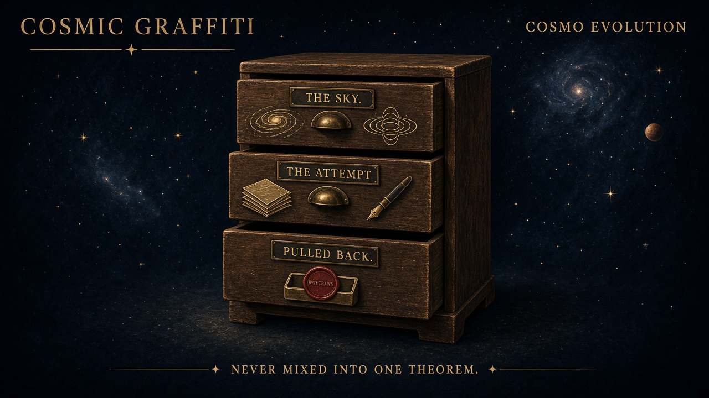

# Cosmo Evolution

**A Cosmic Graffiti beat / column.** Not Domain Architect. Not a live unification.

Standing desk file — 14 September 2026.  
Magazine: [Cosmic Graffiti](https://cosmic-graffiti-magazine.vercel.app/) (one identity; correct spelling).  
Commentator lane: the Frequency (Val8000). Lasting pieces stay in the volume.



*Column mark. Three drawers. Never mixed into one theorem.*

This file is the **how**. Cosmo Evolution sits in the magazine. The live lab stays Domain Architect:

```
DECOMPOSE → CROSS-DOMAIN TRANSLATE → SYNTHESIZE
```

Do **not** file this beat under `domain_architect/`. Do **not** add it to default DECOMPOSE. Gravity stays off that default. Correspondence is a hypothesis, not physical equivalence.

---

## How to use this beat

When an issue touches cosmology, black-hole ringdown, expansion, or the old CosmoEvolution papers, stack the page in this order:

1. **Print the measurement first.** the Frequency leads with real astronomy / cosmology news. Search. Cite the observatory or the paper. Do not invent headlines.
2. **Then Cosmo Evolution commentary.** After the measurement, not instead of it: *here is how we read it / what we tried / what we do not claim.*
3. **Keep three drawers.** Sky, attempt, pulled-back. Never glue them into one theorem.
4. **Ask the Desk may take cosmology questions.** Answers must not resurrect the prime–QNM arrow as a theorem.
5. **Humor may puncture “one object doing three jobs.”** Kind, not mean. Entrain. No shooting match.
6. **Honesty is the product.** A later subscriber vault may sell CosmoEvolution PDFs from `docs/archive/` **if and only if** the retraction / what-remains note travels in the same packet. No fake paywall in git. No packet that ships the attempt without the pull-back.

If a sentence needs the attempt and the sky and the retraction in one breath, split the sentence. The junk drawer with a theorem taped to the front is the joke, not the method.

---

## Three drawers (never mixed into one theorem)

The column mark names them **THE SKY**, **THE ATTEMPT**, and **PULLED BACK**. Keep the labels loud.

### 1. THE SKY — what the sky actually measures

This drawer is instruments and textbooks, not CosmoEvolution glue.

| What | How to say it | What it is not |
|---|---|---|
| Expansion | Cosmologists write a scale factor \(a(t)\). Distant galaxies get farther apart. | Not SFE breathing \(\Phi\). Not a sum of prime-indexed sines. \(a(t)\) is **not** \(\Phi\). |
| LIGO / Virgo / KAGRA ringdown | When a remnant rings, the modes that data can actually hold are the low overtones, typically \(n \approx 0,1\). Complex frequency \(\omega = \omega_R + i\omega_I\). | Not the Motl–Neitzke \(n\to\infty\) tower. LIGO does not see that tower. |
| Quasinormal modes | QNMs as general relativity: the remnant’s mass and spin set the tones. Berti–Cardoso–Will (2006) Kerr tables \((M\omega_R, M\omega_I)\) versus spin. This repo already uses Berti-style fits in `scripts/build_qnm_table.py`. The table that exists here is [`data/qnm_events.csv`](../../data/qnm_events.csv). | Not a prime-or-not label on \((\ell,m,n)\). “Mode 220 is prime” stays retired. |
| Motl–Neitzke (2003) | For highly damped Schwarzschild QNMs, \(\mathrm{Re}(\omega_n)\to \ln 3/(8\pi M)\) as \(n\to\infty\). The \(3\) enters through **monodromy** of the Teukolsky problem. | **Not** the prime-counting function \(\pi(x)\). A number-theoretic constant in an asymptotic is not a theorem that ringdown encodes primes. |

Two different \(H_0\) letters live in this house. Do not glue them.

- **Hubble \(H_0\)** is an expansion rate the sky can constrain (kilometers per second per megaparsec).
- **Experiment 01 \(H_0\)** is a frozen null hypothesis about dimensionless ringdown *ratios* in this repo. Held-out TEST did **not** reject it.

Same letters. Different jobs. The cabinet already has a Hubble drawer and a null-hypothesis drawer. Leave both labeled.

### 2. THE ATTEMPT — what the CosmoEvolution papers tried

Inventory, not a result. Cite files in `docs/archive/`. Read the bodies as **proposed interpretation**.

| Filing | What it attempted | Status in this beat |
|---|---|---|
| [`docs/archive/hb-ringdown/QNM_Prime_Zeta_DA_Analysis_2026-08.md`](../archive/hb-ringdown/QNM_Prime_Zeta_DA_Analysis_2026-08.md) | August 2026 CosmoEvolution Research Program note, *Prime Number Distribution in Black Hole Quasinormal Mode Spectra: A Domain Architect Analysis*. Arrow: primes → zeta → zeros → QNMs → geometry, to be tested with LIGO ringdown. | **Attempt.** The source already carries a 26 August DA-audit correction. Catalog counts in that body (GWTC-5.0 / GW250114 / EHT) are **the paper’s**, not verified by this repository. |
| Paper 9 “harmonic chain” (named inside that August note) | Broader triad: primes, zeta, black-hole ringdown, geometry as one signature. | **Attempt.** Retracted as unification. Do not reprint as a finding. |
| Möbius–GCD \(Q_N(i,j)=\mu(\gcd(i,j))/\gcd(i,j)\) as used in that audit | Meant as a bridge from Riemann zeros to gcd / prime structure. | **Attempt.** In-framework **NO-GO** (first row \(\mu\)-independent; linear identity circular; quadratic identity tautological; spectral bounds only \(O(N)\)). |
| Horizon spectral zeta \(\zeta_{\mathrm{horizon}}(s)=\zeta(s)\) | If the horizon Laplacian’s spectral zeta were Riemann’s \(\zeta\), ringdown might encode primes. | **Attempt.** **Not computed.** |
| Hilbert–Pólya identified with a horizon Laplacian | Stacked conjectures. | **Attempt.** Not a theorem. |
| LIGO O5 as a number-theory experiment | Use upcoming overtones to test the chain. | **Attempt.** Even the Motl–Neitzke tower is \(\ln 3\), not the zeta zeros. |

Other CosmoEvolution-adjacent objects that are **not** this beat’s canon:

- The old DA “Cosmos sixteen knobs” drill is Domain Architect screening, not a Cosmic Graffiti column.
- Prime Field cosmic-scale PDFs under [`docs/archive/prime-field-2026-08-25/`](../archive/prime-field-2026-08-25/) are a different archive shelf.
- The 14 September Harmonic Blueprint math/physics dump is a **shelf book of unknown provenance**. Do not import it as Cosmo Evolution canon.

Letters collide. Do not glue swirl \(\Phi = u_\theta/r\), inverse-GCD Q6 \(H_N\), Möbius–GCD \(Q_N\), FRA output \(\Phi\), or Hubble \(H_0\) into one object. They do not share a job because they share a glyph.

### 3. PULLED BACK — what was withdrawn

Control for this beat:

[`docs/archive/hb-ringdown/QNM_ZETA_WHAT_REMAINS.md`](../archive/hb-ringdown/QNM_ZETA_WHAT_REMAINS.md)

Do not contradict that split note. The August source can stand as a paper **only** with that correction as control. Any vault packet that includes the August note **must** include this file.

| Pulled back | What remains in the other drawers |
|---|---|
| 26 August Domain Architect audit retracted the unification / triad thesis. | Motl–Neitzke, Berti tables, and the Euler product as **citations**. |
| Harmonic Blueprint Experiment 01 is **closed**. Held-out TEST did **not** reject \(H_0\). The predefined prime-neighbor frequency-ratio family was **not supported**. Do not retune. Do not reopen. | Report: [`HB-RINGDOWN-EXPERIMENT-01-REPORT.md`](../archive/hb-ringdown/HB-RINGDOWN-EXPERIMENT-01-REPORT.md). |
| Horizon spectral zeta was not computed. | A later paper would need an independently specified manifold, an actual spectral zeta, and an explicit map \(T\) before anyone stamps `TRANSFORMABLE`. That paper does not exist here. |
| LIGO does not see the \(n\to\infty\) tower. | Low overtones as GR: drawer 1. |
| SFE breathing \(\Phi\) is not \(a(t)\). Breathing is retired as load-bearing. | Expansion stays in drawer 1 as ordinary cosmology. |
| Primes → zeta → zeros → QNMs → geometry as one signature. | Number theory keeps the Euler product. Ringdown keeps Kerr. They do not become one harmonic signature in this magazine. |

Do not salvage the withdrawn arrow as a result. Do not claim Navier–Stokes regularity from this beat. Do not claim a number-theory close from ringdown. Do not put NAV-42, Chat Vault paint, or a black-hole zeta engine into `domain_architect/*.py`.

---

## How Jon uses it in an issue

**the Frequency** prints *real* cosmology / astro news first. Search if you include a sample item. Cite the house that measured it. Then — and only then — a Cosmo Evolution block in three short beats: how we read it / what we tried / what we do not claim.

**Ask the Desk** (sibling lane) may answer reader cosmology questions. A good desk answer points at drawer 1, names drawer 2 as history, and keeps drawer 3 closed. A bad desk answer puts the prime–QNM arrow back on the theorem shelf.

**Subscriber vault (plan, not a fake paywall).** CosmoEvolution PDFs and the `docs/archive/hb-ringdown/` packet may become a paid envelope later. The split note [`QNM_ZETA_WHAT_REMAINS.md`](../archive/hb-ringdown/QNM_ZETA_WHAT_REMAINS.md) must travel with them. Honesty is the product. If the envelope cannot carry the retraction, do not sell the attempt.

**House tone.** Wonder first. Labels loud. Kind. The joke is the one object doing three jobs — a cabinet that insists the sky, the attempt, and the withdrawal are the same drawer. We keep three handles.

---

## First column — What Cosmo Evolution is (and is not)

*Short piece Jon can drop into an issue after a Frequency lead. Copy from the rule above; do not let the column outrun the drawers.*

**Kicker:** Cosmo Evolution · standing column · 14 September 2026

Cosmo Evolution is a Cosmic Graffiti beat. It is not a second lab, and it is not a live unification.

We built it because the same three jobs kept climbing into one sentence: what the detectors measured, what an August CosmoEvolution note hoped those measurements meant, and what this house already pulled back. Those are three drawers. The column exists so they stay three drawers.

**What it is.** A reading lamp. After the Frequency prints a real sky story, this beat says how we read it, what we tried, and what we do not claim. The August 2026 note *Prime Number Distribution in Black Hole QNM Spectra* sits in the attempt drawer, with citations to `docs/archive/`. The 26 August audit that retracted the unification sits in the pulled-back drawer. Motl–Neitzke \(\ln 3\) stays a monodromy fact, not \(\pi(x)\).

**What it is not.** Not Domain Architect. Live work still walks DECOMPOSE → CROSS-DOMAIN TRANSLATE → SYNTHESIZE. Not default DECOMPOSE. Not a proof that primes live in ringdown. Not a close of Navier–Stokes. Not SFE breathing dressed up as the scale factor \(a(t)\). Not the 14 September shelf-book dump, whose provenance we do not know and which we do not promote as this beat’s canon. Not a junk drawer labeled THEOREM.

If one object is doing three jobs, we open the cabinet and put each job back.

### Worked example — news first, then this column

**Frequency lead (measurement, drawer 1).** On 26 May 2026 the Virgo collaboration reported LIGO–Virgo–KAGRA’s Gravitational-Wave Transient Catalogue-5.0: 161 new events from O4b, 390 signals in total since 2015. Among the records: the first measurement of three vibrational modes of a remnant, from the loud event GW250114 (14 January 2025). Those tones agree with general relativity. The same catalog also gives an independent Hubble-constant estimate \(H_0 = 71.0^{+9.0}_{-7.1}\,\mathrm{km\,s^{-1}\,Mpc^{-1}}\) — tighter than the previous catalog, not yet sharp enough to settle the expansion-rate tension. Source: [Virgo, 26 May 2026](https://www.virgo-gw.eu/news/the-new-ligo-virgo-kagra-catalog-sets-new-records-in-precision-gravitational-astronomy/). Companion cosmology paper: [arXiv:2605.27227](https://arxiv.org/abs/2605.27227).

**Cosmo Evolution comment (after).**

*How we read it.* Three tones from one remnant are drawer 1: GR ringdown, low overtones, typically \(n \approx 0,1\). That is a black hole ringing like a bell, not the Motl–Neitzke \(n\to\infty\) tower. Hubble’s \(H_0\) in that release is an expansion rate. It is not Experiment 01’s frozen null.

*What we tried.* The August CosmoEvolution note asked whether primes, zeta zeros, QNMs, and horizon geometry were one signature, and it pointed at LIGO catalogs as a test. That is drawer 2. This repository did not independently verify that note’s catalog counts; the ringdown table we actually ran is `data/qnm_events.csv`.

*What we do not claim.* Unification withdrawn, 26 August. Experiment 01 closed: held-out TEST did not reject its \(H_0\); the prime-neighbor family was not supported. Horizon spectral zeta not computed. LIGO does not see the highly damped tower. We do not promote three measured tones into a number-theory theorem. Split note: [`QNM_ZETA_WHAT_REMAINS.md`](../archive/hb-ringdown/QNM_ZETA_WHAT_REMAINS.md).

That is the whole method. Sky. Attempt. Pulled back. Then stop.

---

## Empty trays (later issues)

Paste into an issue. Leave blank until a real measurement exists. Do not invent the Frequency lead.

### Tray — Frequency lead (THE SKY)

- Date:
- Observatory / collaboration:
- Link:
- One-sentence measurement:
- Overtones actually held by the data (\(n \approx\) ?):
- If expansion is in the story, write Hubble \(H_0\) with units, and do not mix it with Experiment 01:

### Tray — Cosmo Evolution comment (after the lead)

- How we read it (drawer 1):
- What we tried (drawer 2):
- What we do not claim (drawer 3):
- Split-note pointer (required): `docs/archive/hb-ringdown/QNM_ZETA_WHAT_REMAINS.md`

### Tray — Ask the Desk (optional)

- Reader question:
- Drawer the answer lives in:
- Sentence that will **not** be written: the August prime–QNM arrow as a theorem.

### Tray — vault packet (plan)

- Archive files to include:
- Split note included? (must be yes):
- If no, do not sell:

---

## Paste-ready Substack / Skool blurb

Cosmo Evolution is a Cosmic Graffiti column, not a second physics engine.

We print real sky news first — expansion, LIGO ringdown, QNMs as general relativity. Then we say what an August CosmoEvolution note attempted (primes → zeta → ringdown → geometry), and what this house already pulled back: the unification was retracted on 26 August; our ringdown experiment stayed null; the horizon spectral zeta was never computed. Motl–Neitzke’s \(\ln 3\) is monodromy, not the prime-counting function.

Three drawers. Never mixed into one theorem. The archive can be a paid packet later only if the retraction note travels with it. Honesty is the product.

Live lab remains Domain Architect. This is the magazine.

---

## Filing notes for editors

- Spelling: **Cosmic Graffiti**. Older “GRAFITTI” swirl leftover pages are a different stack; do not revive them as this magazine.
- Locked live-site copy (when present): `docs/archive/cosmic-graffiti-magazine-2026-09-13/`.
- Autobiography stays out of git.
- Do not close open regularity or number-theory problems from this beat.
- If Frequency and Ask the Desk files land beside this one under `docs/cosmic-graffiti/`, they share the magazine identity. This file owns only the Cosmo Evolution beat.
