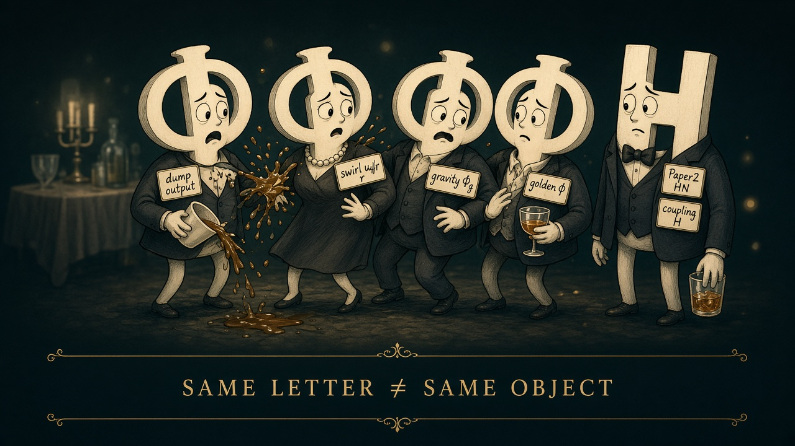

# News from the neighborhood

**Cosmic Graffiti** · **The Frequency** · 14 September 2026  
Jonathan Simons · Prime Field Technologies LLC · Savannah, GA  
Working chapter on the desk. Wonder first. Labels loud.

*The Frequency · 14 September 2026*

**Cosmic Graffiti** is the magazine. **The Frequency** is the news feed that goes into it.

This card is the assembly-desk handle for the 14 September working chapter. Full sourced copy with dates and URLs lives in `docs/cosmic-graffiti/issues/2026-09-14-the-frequency.md`. Paste that file for the long Substack. This page is the magazine chrome and the honesty locks.

What this issue is:

- six sourced news items from the area we actually work in
- a short piece on a coffee cup
- a lab update tray Jon can edit
- a humor panel, because letters collide
- an honest inventory of apps and demos
- a subscriber **plan**, labeled as a plan

What this issue is not:

- a live paywall
- a Domain Architect filing office
- a claim that unaugmented Navier–Stokes regularity is closed
- a claim that the Riemann hypothesis is proved
- a second magazine with a new name

**DA-VC-01** remains **FAIL**. Unaugmented leftover **OPEN**. Reported ≠ certified. Correspondence ≠ physical equivalence.

## Six Frequency chips (full citations in the working chapter)

1. A ruler in the galaxy map, and a maybe about dark energy (DESI; not a five-sigma discovery).
2. Three hundred and ninety rings in the catalog (GWTC-5.0), and a listening window ahead.
3. A gym for teaching machines to push on turbulence (HydroGym; local skin friction, not a hull number).
4. Bounded gaps between primes moved. Twin primes did not.
5. Light from 280 million years after the start (MoM-z14 spectrum).
6. A company announced a blowup. A quieter preprint left an endpoint open. **Reported · not DA-certified.**

## Around us

*The swirl in the cup is doing the work without a press kit.*

## Humor

*Same letter ≠ same object. Swirl Φ, Domain Architect Φ, gravity Φg — different guests.*

Live HTML stack: [cosmic-graffiti-magazine.vercel.app](https://cosmic-graffiti-magazine.vercel.app/)

---

*VAL8000 sits after the news. See `val.md`.*

*Cosmic Graffiti · the Frequency · for the record / not the last word.*
