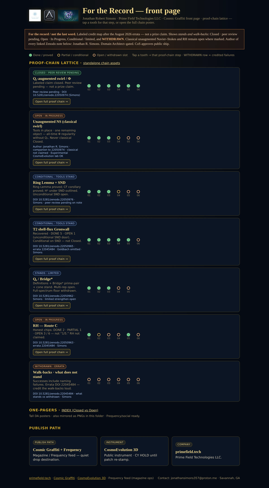
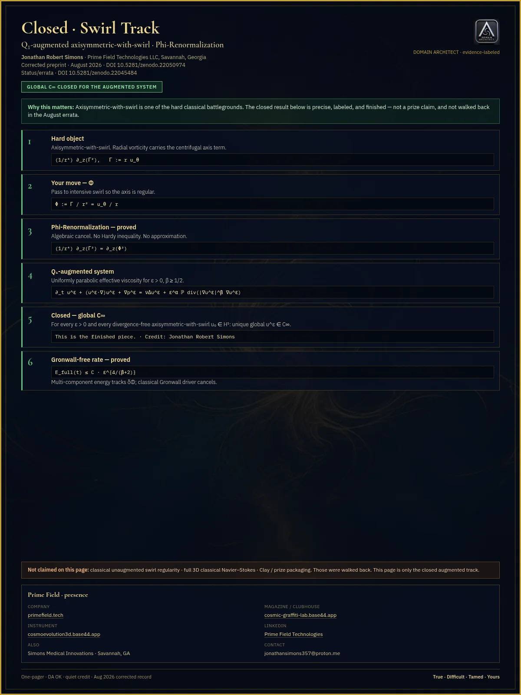
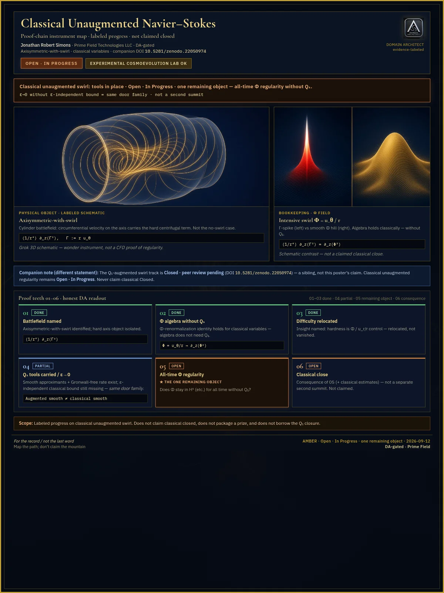

# Open Progress Report

**Cosmic Graffiti** · posters as the paper · 12 September 2026  
Jonathan Simons · Prime Field Technologies LLC · Savannah, GA  
Where we’ve been — stands · open · withdrawn. Not a close.

*For the Record — the front paper. Closed · peer review pending · Open · In Progress · Conditional / limited · WITHDRAWN.*

Jonathan’s been deep on this track this week. A lot of headway landed over the weekend — *labeled maps, honest open doors, walk-backs where claims didn’t stand.* Stay tuned.

The stamped posters are the paper. They show the path actually walked: a labeled close on one **augmented** statement, open doors left open, tools that stand under their hypotheses, and walk-backs credited loud.

## For the record / not the last word

Evidence labels only. No new math. No new claims beyond the stamped inventory. Classical unaugmented swirl remains **Open · In Progress**. **DA-VC-01** remains **FAIL**. The Riemann hypothesis is not claimed. Correspondence across tracks is a hypothesis, not physical equivalence.

## Path map

| ID | Track | Label | DOI |
|---|---|---|---|
| G1 | Q₁-augmented swirl | Closed · peer review pending · **augmented only** | [22050974](https://doi.org/10.5281/zenodo.22050974) |
| G2 | Unaugmented classical swirl | **Open · In Progress** · leftover OPEN | Companion to 22050974 |
| G3 | Status & errata | WITHDRAWN walked back loud | [22045484](https://doi.org/10.5281/zenodo.22045484) |
| G4 | Ring | Conditional · tools stand | [22050976](https://doi.org/10.5281/zenodo.22050976) |
| G5 | Q₆ / Bridge* | Stands · limited · full-spectrum floor WITHDRAWN | [22050962](https://doi.org/10.5281/zenodo.22050962) |
| G6 | Route C | Open · In Progress · RH not claimed | [22050963](https://doi.org/10.5281/zenodo.22050963) |
| T2 | Shell-flux | Conditional · tools stand | [22050965](https://doi.org/10.5281/zenodo.22050965) |

Never ship **G1** without **G2**. They are different statements.

## The pair — never one without the other

*G1 · Closed · peer review pending · augmented only · DOI 22050974*

*G2 · Open · In Progress · one remaining object · mountain not claimed*

## WITHDRAWN (loud)

Errata pointer on every science outbound: [doi.org/10.5281/zenodo.22045484](https://doi.org/10.5281/zenodo.22045484)

- Full-spectrum Bridge floor — **WITHDRAWN**
- Triple Lock packaging — **WITHDRAWN**
- MD “resolved” theater — **WITHDRAWN**
- Older superseded deposits — use 22050974 + errata as the current map

Successes include naming failures. The weekend headway is partly that: doors left open, overclaims walked back.

Live: [cosmic-graffiti-magazine.vercel.app/open-progress](https://cosmic-graffiti-magazine.vercel.app/open-progress/)

---

*VAL8000 sits after this report. See `val.md`.*

*Cosmic Graffiti · for the record / not the last word.*
