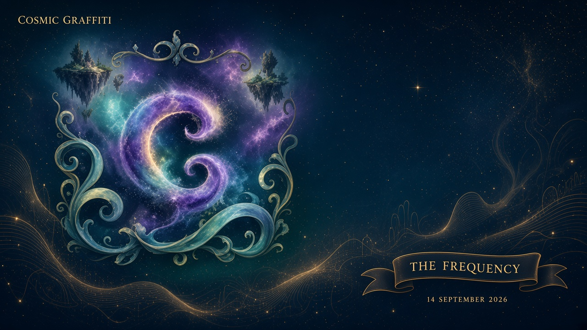
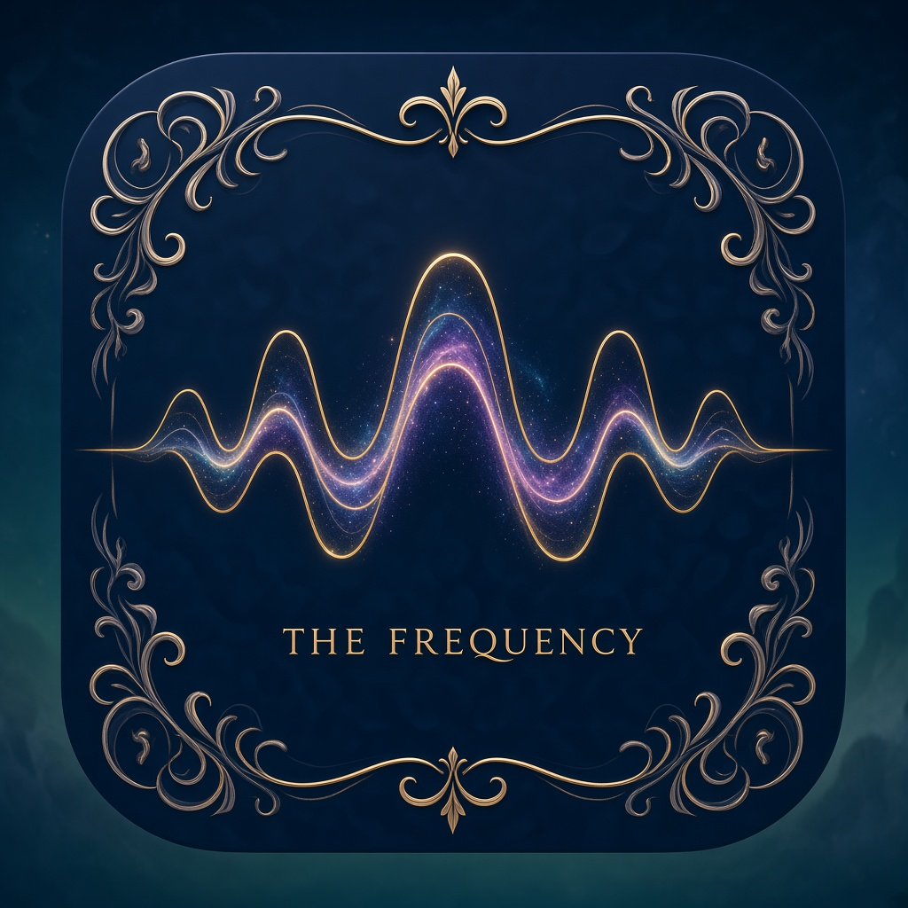

> **Desk note (delete before Substack):** Working file for Cosmic Graffiti / The Frequency. Duplicate for later issues. Trays: `_trays/`. Upload the PNGs when you paste. This issue does **not** turn on a paywall. Live lab is Domain Architect. Pictures also sit in this `assets/` folder.

# News from the neighborhood

**Cosmic Graffiti** · **The Frequency** · 14 September 2026  
Jonathan Simons · Prime Field Technologies LLC · Savannah, GA  
Paste-ready desk copy. Wonder first. Labels loud.



*Alt: Dark editorial masthead. Cosmic Graffiti’s ornate G sits in filigree on a star field. A gold ribbon reads THE FREQUENCY, 14 September 2026.*

---

## 1. Masthead

**Cosmic Graffiti** is the magazine. **The Frequency** is the news feed that goes into it.

This is a public table for math and physics as they actually show up around us — fluids, primes as mathematics, cosmology as public science. It is not a unification gospel. Correspondence between domains is a hypothesis, not physical equivalence.

House line, already on the site: *for the record / not the last word.*

What this issue is:

- six sourced news items from the area we actually work in
- a short piece on a coffee cup
- a one-page lab update Jon can edit
- a humor panel, because letters collide and hype is cheap
- an honest inventory of apps and demos
- a subscriber plan, labeled as a plan

What this issue is not:

- a live paywall
- a Domain Architect filing office
- a claim that unaugmented Navier–Stokes regularity is closed
- a claim that the Riemann hypothesis is proved
- a second magazine with a new name

The public HTML stack is still [cosmic-graffiti-magazine.vercel.app](https://cosmic-graffiti-magazine.vercel.app/). This markdown file is the working chapter you can keep adding to.



*Alt: Square magazine mark. Gold nested waves on navy, filigree corners, caption THE FREQUENCY.*

---

## 2. The Frequency

Six stories. Dates and URLs on every one. If a later editor cannot verify a headline, drop it.

### 2.1 A ruler in the galaxy map, and a maybe about dark energy

**When:** collaboration news 19 March 2025; journal paper 6 October 2025; supernova recalibration 14 April 2026.  
**What they measured:** baryon acoustic oscillations — a faint preferred spacing left over from sound waves in the early universe — in more than 14 million galaxies and quasars from DESI Data Release 2.

DESI’s own press line (Berkeley Lab, 19 March 2025): taken *alone*, the DESI distances fit the standard picture (a cosmological constant plus cold dark matter). Combined with the cosmic microwave background, supernovae, and weak lensing, a model where dark energy’s equation of state changes with time fits better. The collaboration did **not** claim a five-sigma discovery. Combined significance in the DR2 BAO paper runs from about 2.8 to 4.2 sigma depending on which supernova compilation you glue on. DESI plus CMB alone is quoted at 3.1 sigma for a time-evolving \(w_0,w_a\) over a constant.

In April 2026, Popovic, Shah, Kenworthy and the Dark Energy Survey published DES-Dovekie, a recalibrated supernova sample. Combined with CMB and DESI DR2, they report 3.2 sigma against a pure cosmological constant — down from 4.2 sigma on the earlier supernova set — and they call that a **weak** model preference on the usual odds.

**Sources**

- DESI Collaboration (Abdul Karim et al.), *Phys. Rev. D* **112**, 083515 (published 6 October 2025), [doi:10.1103/tr6y-kpc6](https://doi.org/10.1103/tr6y-kpc6). Preprint: [arXiv:2503.14738](https://arxiv.org/abs/2503.14738).
- Berkeley Lab, 19 March 2025, [New DESI Results Strengthen Hints That Dark Energy May Evolve](https://newscenter.lbl.gov/2025/03/19/new-desi-results-strengthen-hints-that-dark-energy-may-evolve/).
- DESI, 19 March 2025, [‘More Than a Hint’ of Evolving Dark Energy](https://www.desi.lbl.gov/2025/03/19/more-than-a-hint-of-evolving-dark-energy-new-results-and-data-from-desi/).
- B. Popovic et al. (DES Collaboration), *MNRAS* **548**, stag632 (published 14 April 2026), [doi:10.1093/mnras/stag632](https://doi.org/10.1093/mnras/stag632). Preprint: [arXiv:2511.07517](https://arxiv.org/abs/2511.07517).

**CG comment.** A standard ruler in a three-dimensional map is a real instrument. “Dark energy is evolving” is a fit, still sensitive to which supernova catalog you trust. Euclid’s first public foundation release is scheduled for November 2026 ([ESA/Euclid DR1 timeline, updated 15 June 2026](https://www.cosmos.esa.int/web/euclid/dr1-timeline)) — more sky, more chance for the maybe to sharpen or to fade. We do not need a new private cosmology to find this interesting. The night sky is already doing the work.

### 2.2 Three hundred and ninety rings in the catalog, and a listening window ahead

**When:** 26 May 2026.  
**What they released:** GWTC-5.0, the LIGO–Virgo–KAGRA catalog through the second part of the fourth observing run (O4b). One hundred sixty-one new compact-binary candidates with astrophysical probability at least one half. Cumulative catalog: 390. The new well-measured events in O4b are consistent with binary black holes. Five of them have network signal-to-noise above 30; the loudest quoted in the results write-up is 76.9 for GW250114_082203.

The detectors are now in upgrades. The collaborations’ public plan (15 August 2026 update) is a six-month intermediate run, IR1, beginning between late October and mid-November 2026. Both LIGO sites intend to observe. Virgo may drop out for maintenance. KAGRA joins as available.

**Sources**

- LIGO Scientific Collaboration, [O4b catalog page](https://ligo.org/detections/o4b-catalog/), 26 May 2026.
- LIGO-P2600152, [GWTC-5.0 results](https://dcc.ligo.org/LIGO-P2600152/public). Preprint: [arXiv:2605.27225](https://arxiv.org/abs/2605.27225).
- [GWOSC GWTC-5.0 data release](https://gwosc.org/GWTC-5.0/).
- [LIGO/Virgo/KAGRA observing plans](https://observing.docs.ligo.org/plan/), 15 August 2026 update.

**CG comment.** These are measurements of spacetime ringing from colliding compact objects. That is already wonder enough. It is not a proof that every letter \(\Phi\) in a notebook is gravity. Domain Architect keeps Einstein and Newtonian \(\Phi_g\) **off** default decompose (decision A11) because DA is a role lab, not a gravity theory. The interferometers do not need us to rename them.

### 2.3 A gym for teaching machines to push on turbulence

**When:** *Nature* issue dated 10 September 2026 (accepted 14 July 2026; arXiv from December 2025).  
**What they built:** HydroGym — more than sixty standardized reinforcement-learning environments for flow control, from laminar cases up toward Reynolds number \(4\times 10^5\), in two and three dimensions. Cover story of *Nature* **657**, 8131.

The headline demonstration: agents trained on cheaper surrogate environments transferred, with no extra on-wing training, to a three-dimensional NACA 0012 wing section and cut **local** skin friction by 38 percent, with exploration cost down by about four orders of magnitude versus optimizing on the wing itself. The authors say the transfer leans on shared near-wall physics, and they say **the breadth of generalization remains open**.

**Sources**

- C. Lagemann, R. Vinuesa, S. L. Brunton et al., *Nature* (2026), [doi:10.1038/s41586-026-10917-6](https://www.nature.com/articles/s41586-026-10917-6).
- *Nature* **657**, 8131 (10 September 2026), [Taming turbulence](https://www.nature.com/nature/volumes/657/issues/8131).
- Preprint: [arXiv:2512.17534](https://arxiv.org/abs/2512.17534).

**CG comment.** This is control, with a shared testbed. It is not a solution of the mathematical regularity question, and it is not a ship-scale drag number you can stamp on a hull. Domain Architect’s turbulence-reduction program is a separate, boring object: ships slot ACTIVE, trapezoidal riblets selected, 8 percent contained and 12 percent not, phononic overlay catalogued and not selected. Do not add HydroGym’s 38 percent to that 8 percent. Different plant, different metric, different claim.

### 2.4 Bounded gaps between primes moved. Twin primes did not.

**When:** 31 August 2026 (Stadlmann); OpenAI PDF dated 30 August 2026, discussed in the press on 3–11 September.  
**What was proved, as stated:** infinitely many pairs of consecutive primes differ by at most some even number \(H_1\). Polymath8b had \(H_1 \le 246\). Julia Stadlmann (University of Illinois Urbana–Champaign) posted \(H_1 \le 240\) on 31 August. An OpenAI note, proof credited in the abstract to GPT-6 Astra, claims DHL[40, 2] and therefore \(H_1 \le 186\), with a Lean formalization conditional on numerical certificates and finite-field exponential-sum bounds. Science News (11 September 2026) also reports an Axiom Math improvement to 212 sitting between those two.

The twin-prime conjecture is the statement that 2 works. Nobody in these papers claims 2.

**Sources**

- J. Stadlmann, *Bounded gaps between primes*, [arXiv:2608.31126](https://arxiv.org/abs/2608.31126), submitted 31 August 2026.
- OpenAI, *Improved short gaps between primes*, 30 August 2026, [PDF](https://cdn.openai.com/pdf/51126fac-1b68-4128-9666-c908bcc16033/short_gaps.pdf).
- Dana Mackenzie, *Science News*, 11 September 2026, [A human set a new mathematical record. Then AI came for it](https://www.sciencenews.org/article/human-math-record-twin-primes-openai).

**CG comment.** A smaller bound is a smaller bound. It is number theory about sieves and admissible tuples, not a secret arithmetic of the cosmos, and it is not the Riemann hypothesis. In this repo the inverse-GCD / Q6 book is a **separate shelf**. Do not glue that \(H_N\) to Paper2’s \(H_N\), or to Domain Architect’s coupling letter \(H\). Same letter, different object — see Humor.

### 2.5 Light from 280 million years after the start

**When:** preprint 16 May 2025; published 30 January 2026 in *The Open Journal of Astrophysics*.  
**What they saw:** MoM-z14, a compact luminous source in the COSMOS field, spectroscopically at \(z = 14.44 \pm 0.02\). NIRSpec/prism: a sharp Lyman-α break and about 3σ detections of five rest-UV emission lines. The authors argue it is resolved and elongated, so an unobscured AGN is unlikely to dominate the UV light. They also say the implied number density of bright \(z \sim 14\)–15 galaxies in their small survey is more than a hundred times pre-JWST consensus models — with error bars large enough to read twice.

**Sources**

- R. P. Naidu, P. A. Oesch, G. Brammer et al., *Open Journal of Astrophysics* **9** (30 January 2026), [doi:10.33232/001c.156033](https://doi.org/10.33232/001c.156033).
- Preprint: [arXiv:2505.11263](https://arxiv.org/abs/2505.11263).

**CG comment.** A spectrum is not a press release. Redshift 14.44 is a real distance in an expanding universe, and the surprise is how quickly stars seem to have gotten to work. That pressure lands first on galaxy-formation recipes (how efficiently gas turns into stars, how bursty, how dusty). It does not, by itself, retire the standard expansion model. Public cosmology is allowed to be this strange without us writing a private field equation over it.

### 2.6 A company announced a blowup. A quieter preprint left an endpoint open.

**When:** 8 September 2026 (company note and Quanta report); quieter preprint 3 September 2026.  
**What was announced:** OpenAI posted that an internal system constructed a three-dimensional incompressible Navier–Stokes flow, starting from rest, with a smooth compactly supported force, whose velocity becomes unbounded in finite time while kinetic energy stays bounded. They posted a PDF and said a Lean formalization exists. Quanta Magazine reported the announcement the same day, including a priority dispute with other groups working on related Euler/Navier–Stokes constructions. Independent mathematicians are still reading. This magazine does **not** certify the Lean statement, and it does **not** treat the announcement as a closed theorem.

The same week, a quieter preprint ([arXiv:2609.03877](https://arxiv.org/abs/2609.03877), 3 September 2026) proves a scaling-critical regularity *criterion* from one velocity component in a Chemin–Lerner / Besov refinement, and leaves the ordinary strong-time mixed-norm endpoint open.

**Sources**

- OpenAI, 8 September 2026, [company note](https://openai.com/index/navier-stokes-solution/) and [PDF](https://cdn.openai.com/pdf/32d9f210-8b73-45e0-91bc-82a30aef8a9a/navier-stokes.pdf).
- Konstantin Kakaes, *Quanta Magazine*, 8 September 2026, [report](https://www.quantamagazine.org/ai-has-solved-one-of-maths-1-million-millennium-prize-problems-20260908/).
- *A Critical Chemin–Lerner Regularity Criterion via One Velocity Component…*, [arXiv:2609.03877](https://arxiv.org/abs/2609.03877), 3 September 2026.

**CG comment.** The Navier–Stokes equations say how a viscous incompressible continuum carries momentum. They do not say your coffee will explode. A constructed blowup, even if later accepted, would be a fact about an ideal description with a chosen force — not a certificate that Domain Architect “solved fluids,” and not a reason to overwrite **DA-VC-01**, which remains **FAIL**. Unaugmented axisymmetric swirl, in this lab, remains **open**. Issue 1 of the HTML magazine already marked a swarm-scale attempt *reported · not DA-certified*. We keep that label. We also keep the quieter paper in view: progress on criteria is not the same as a closed existence theory, and an arXiv PDF is a preprint until the community says otherwise.

---

## 3. Around us

### The swirl in the cup is doing the work without a press kit


*Alt: Morning kitchen table. White cup, cream poured into coffee in two or three honest turns, silver spoon, teal cloth. No overlay of galaxies.*

Pour milk into coffee. For a few seconds you can see a spiral, then folds, then a mess that still has structure if you look at the small scales, then a uniform tan. That is a viscous fluid on a table, with a free surface, heat leaking into the mug, and gravity holding the free surface almost flat.

The Navier–Stokes equations — mass conservation plus Newton’s second law for a continuum with viscosity — are the standard description of that motion if you pretend the drink is a smooth field, not a crowd of molecules. They tell you how velocity and pressure have to fit together. They do **not**, by themselves, tell you whether a perfectly smooth mathematical solution must stay smooth forever. That last question is a theorem about an idealization. The cup does not wait for the theorem. The cup cools.

If this paragraph wanders near “Navier–Stokes” in the research sense: the equations describe momentum transport. Nobody in this magazine is closing the open regularity problem. HydroGym (Frequency 2.3) is trying to *control* turbulent flow in a computer. LIGO (Frequency 2.2) is listening to a different kind of wave. The cream in the mug is the thing you already own.

Same neighborhood. Different instruments. No need to glue their letters.

---

## 4. What I’m doing

**Live tool:** Domain Architect. Local desktop app, not a public website.

```
DECOMPOSE → CROSS-DOMAIN TRANSLATE → SYNTHESIZE
```

Open it on the machine that has this repo:

```bash
python3 -m domain_architect app
```

That serves `http://127.0.0.1:8765/`. Spec: `docs/DOMAIN-ARCHITECT.md`. Operator contract: `docs/domain-architect/DA-MODE.md`. Recorded decision: **accept grok table**.

What that means in English:

- Systems from different domains may share *roles* (dissipation, transport, constraint) without being the same physical thing.
- A5: no `TRANSFORMABLE` stamp without a morphism and a witness. Analogy is not substitution.
- A11: gravity / Einstein stay off default decompose. Newtonian \(\Phi_g\) is not DA’s output letter \(\Phi\).
- SFE, UHF, DHFA, Harmonic Blueprint, QStack, Q OS, Fluid-Q, NAV-42-as-product, Chat Vault, E8 visualizer, resonant paint, and 2.2 Hz are **not** the live product. They live under `docs/archive/` when they live at all.

**Public table:** this magazine. The Frequency is how news of the area comes in. Jon’s papers stay on their own shelves (`docs/papers/swirl`, `gcd`, `ns-snd`, `ring`). Sharing a Greek letter across those shelves is not a theorem.

**Turbulence-reduction program** (already in DA mode): one project, four application slots. Ships = ACTIVE (Maersk-class study; trapezoidal riblets selected; 8% contained, 12% not). Aircraft including drones, submarines, hypersonic = QUEUED. Correspondence across slots is analogy until someone writes a real \(T\).

**Not in this issue as a live theory:** a 14 September 2026 equation dump archived under `docs/archive/sfe-hb/`. Shelf book. Unknown provenance. Unknown author. Not imported here.

**DA-VC-01** (unaugmented swirl challenge): **FAIL**. Do not overwrite it.

### Jon’s update *(paste here)*

*Status: empty tray. Replace these italics with whatever is actually true this week — a cycle you ran, a paper face you are reading, a walk-back, a photo from the desk. No closed theorems unless they are closed.*

---

## 5. Humor

A check on not taking ourselves too seriously.


*Alt: Kind cartoon. Four capital Phi figures in evening clothes, identical letter-heads, different name tags, one of them spilling coffee. A capital H looks at two stacked name tags. Gold caption: SAME LETTER ≠ SAME OBJECT.*

**Caption.** They arrived in the same tuxedo. They are not the same guest. Dump-output \(\Phi\), swirl \(\Phi = u_\theta/r\), Newtonian \(\Phi_g\), and golden-ratio \(\varphi\) will all answer if you shout “fie” across a lab. Paper2 \(H_N\) and a coupling \(H\) will both answer if you shout “aitch.” Domain Architect’s job, when it is behaving, is to refuse the hug. News-hype hugs are the same mistake in a louder room: a 38 percent local skin-friction cut is not an 8 percent hull number; a 3-sigma cosmological fit is not a new force of nature; a company PDF is not a digested theorem.

Kind, not mean. We have all been the person who used one letter for two objects.

---

## 6. Apps for fun

Inventory of what is actually here. Fun, not a store. **Shipped** means it runs in this repo on a local machine. **Sketch** means another branch or an HTML toy. **Archive** means do not plug it into `domain_architect/*.py`. **Idea** means a sentence, not a product.

| Name | Where | Status | Notes |
|---|---|---|---|
| Domain Architect | `python3 -m domain_architect app` | **shipped locally** | Decompose / Translate / Synthesize / Cycle / Mark / Archive tabs. Not a public website. |
| Lambda Lab | Mark tab → Lambda Lab | **shipped locally** | Vector construction of the DA mark. Brand geometry, not a physical claim. |
| DA CLI | `python -m domain_architect …` | **shipped locally** | Named cycles include leftover-repair, localized-repair, available-turbulence, turbulence-reduction. |
| Brand lockups | `assets/brand/`, Mark tab | **shipped locally** | Black & gold and all-silver. Official looks. |
| Archive browser | Archive tab; `python -m domain_architect --archive` | **shipped as inventory** | Historical objects. Not a product pane in the A1 sense; still visible so the shelf is honest. |
| Cosmic Graffiti HTML | [vercel site](https://cosmic-graffiti-magazine.vercel.app/) | **live magazine site** | Previous stack. Issue 1, For the Record, Open Progress. This markdown folder is the working chapter. |
| Frequency feed (this issue) | `docs/cosmic-graffiti/frequency/feed.json` | **working file** | News items with URLs. Not a push-notification product. |
| Phone “GRAFITTI” leftover | other git branches, `apps/cosmic-grafitti/` | **sketch, other tree** | Typo in the folder name. Swirl leftover cut. Not this branch. |
| Chat Vault | other git branches | **not live product** | Do not write it into `domain_architect/*.py`. |
| `qc_qr_toys.py`, black-hole matplotlib paste | `docs/archive/nav-42-cbfd-2026-04/` | **archive toys** | Explicitly not live DA. |
| E8 visualizer / resonant paint / 2.2 Hz / Fluid-Q / Q OS / NAV-42-as-product | — | **not canonical** | Not an app listing. Archive only if present. |
| Subscriber app pack | — | **idea / plan** | See §7. Not shipped. |

If it is not in the table, do not invent a listing.

---

## 7. Subscriber table (plan)

Front door, if Jon wants a public one: **Substack** and/or **Skool**. This issue does **not** turn on a paywall in the repo. There is no Cosmic Graffiti paywall live here. A different Jonathan Simons runs an education-policy Substack; that is not this magazine. No Skool classroom for Cosmic Graffiti was found at writing. The Vercel site is free HTML.

| Lane | Status | What it would be |
|---|---|---|
| Free: The Frequency | **this file** + existing Vercel rail | Sourced news, CG comments, room to talk |
| Free: wonder essays | **this file**, Around us | Ordinary-life physics/math, labeled |
| Paid: apps | **plan, not live** | Packaged access to local DA docs, demos, and later installers Jon actually builds |
| Paid: archive / IP packet | **plan, not live** | Historical patent-style documents and related archive Jon may *choose* to share. **Not** DA filings. **Not** “we patented the universe.” DA does not file patents. Jon has said he is not suing. |
| Paid: deeper lab notes | **plan, not live** | Cycle reports, paper-face maps, walk-backs. Still not closed theorems by subscription. |
| Paywall code in this repo | **off** | Do not fake one. |

Clear split: **exists now** = Domain Architect on a local machine, this working magazine, the free Vercel stack. **Does not exist now** = a charged gate in git, a Skool classroom, a Cosmic Graffiti Substack with a subscribe button that unlocks apps.

If Jon later stands up Substack or Skool, paste the URL into this table and change the status word. Until then, the word is **plan**.

---

## 8. Empty trays

Stories you write will not be the only things in this file. Use the slots. Or drop files in `_trays/`.

### 8.1 Jon’s story

*Paste a piece in your own voice. Not childhood autobiography in git. Not a coincidence diary. A thing you actually saw or actually ran.*

Title:

Date:

---

### 8.2 Photos

*Drop files in `assets/` and list them.*

| File | Alt text | Caption |
|---|---|---|
| | | |

---

### 8.3 Later Frequency items

*Date, URL, two-sentence paraphrase, CG comment. No URL → no item.*

1.
2.
3.

---

### 8.4 Letters / room to talk

*A note from a reader, a correction, a “you glued two letters.” Kind.*

---

### 8.5 Next issue masthead

Date:

Lead picture:

One sentence for the Frequency rail:

---

## Posting notes (Substack)

- **Title:** News from the neighborhood
- **Subtitle:** Cosmic Graffiti · The Frequency · 14 September 2026
- **Upload:** masthead PNG, Frequency mark, coffee swirl, humor panel (in that order is fine).
- **Delete** the desk note at the top before publishing.
- **Do not** enable a paywall for this issue unless you have actually built the paid pack. The subscriber section is a plan.
- Keep the source links. They are the difference between a magazine and a rumor.

A short Skool variant is in [`2026-09-14-skool-post.md`](2026-09-14-skool-post.md).

---

*Cosmic Graffiti · the Frequency · for the record / not the last word.*
