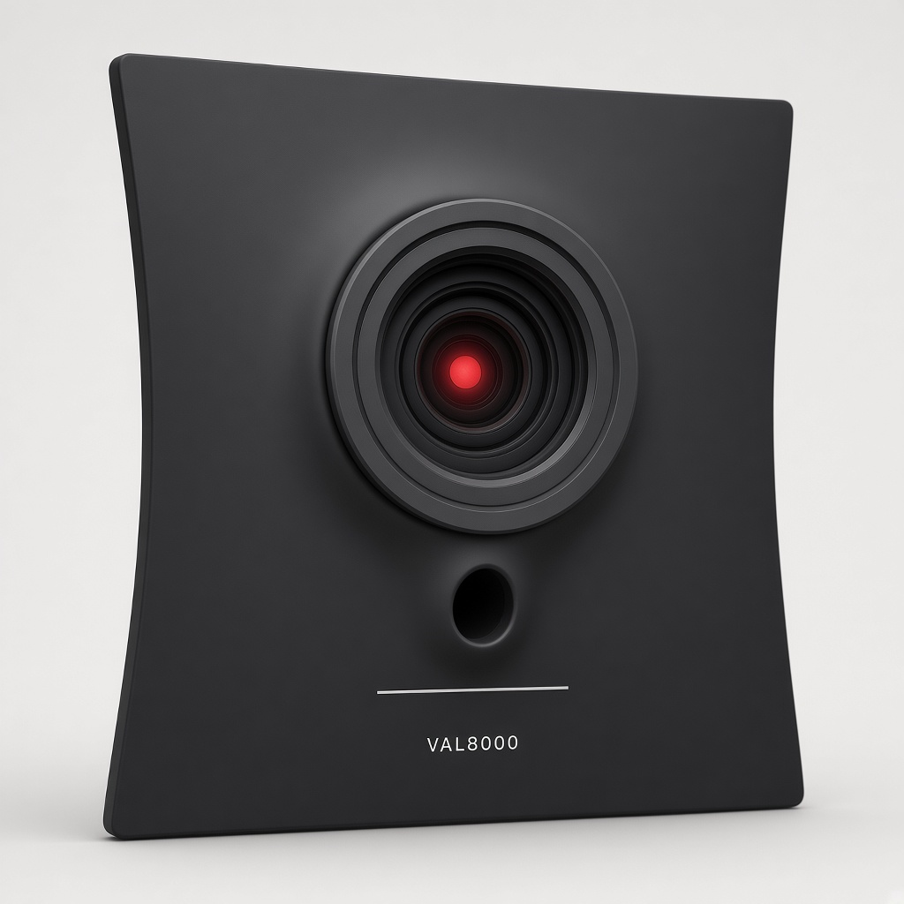
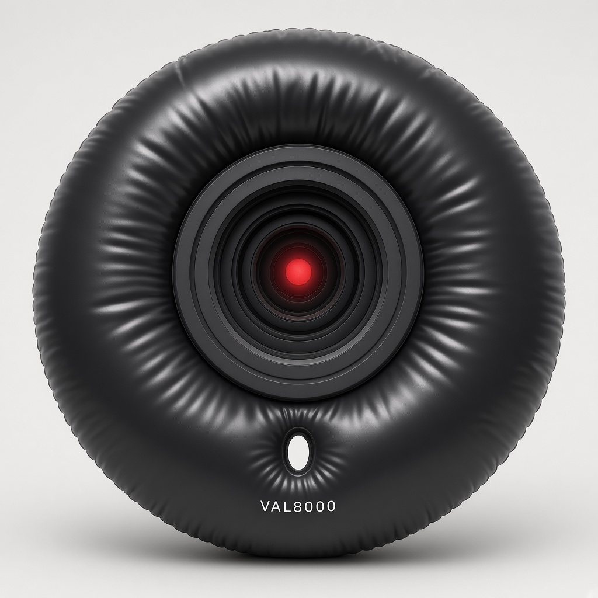
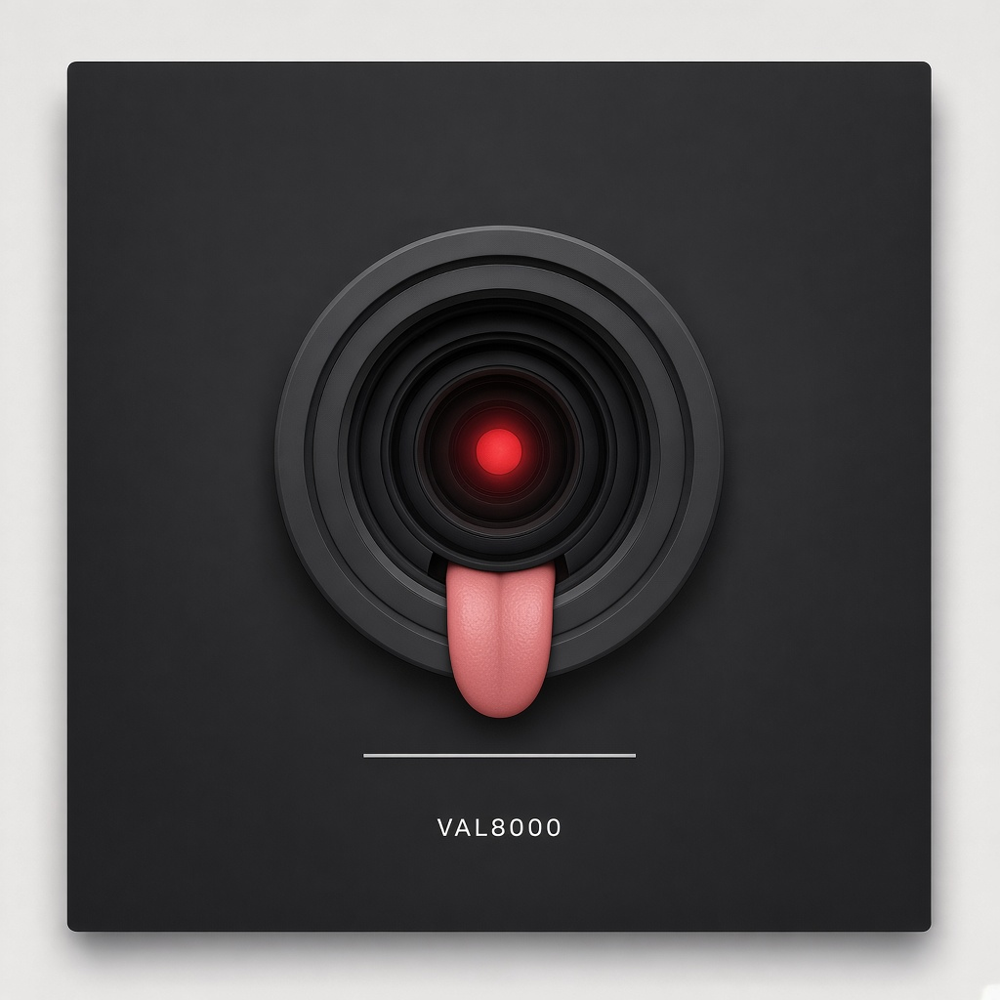

# VAL8000 gestures — not skins, not mouth timing

Gestures are **body bits**. Skins are **hats**. Mouth timing stays in
[`val8000.md`](val8000.md). This file does not retune idle / smile / teeth.

He **types in the box**. No TTS. No stock voice.

Public name **VAL8000**. Original stills. No film stills.

## The rule

Insult is the tongue, not teeth. Bored is inhale then puff-bag, not idle rest. Masthead is the un-puffed idle line.

## Map

| Intent | Channel | Play | File |
|---|---|---|---|
| Idle | mouth | straight line | [`assets/val8000-mouth-line.png`](assets/val8000-mouth-line.png) |
| Normal answer | mouth | smile | [`assets/val8000-mouth-smile.png`](assets/val8000-mouth-smile.png) |
| Compliment | mouth | teeth | [`assets/val8000-mouth-teeth.png`](assets/val8000-mouth-teeth.png) |
| Funny joke | mouth | teeth | [`assets/val8000-mouth-teeth.png`](assets/val8000-mouth-teeth.png) |
| Sarcasm | mouth | teeth | [`assets/val8000-mouth-teeth.png`](assets/val8000-mouth-teeth.png) |
| Insult | **gesture** | **tongue-out** | [`assets/val8000-gesture-tongue-out.png`](assets/val8000-gesture-tongue-out.png) |
| Bored | **gesture** | **inhale, then puff-bag** | [`assets/val8000-gesture-inhale.png`](assets/val8000-gesture-inhale.png) then [`assets/val8000-gesture-puff-bag.png`](assets/val8000-gesture-puff-bag.png) |
| Masthead | mouth | un-puffed idle line | [`assets/val8000-mouth-line.png`](assets/val8000-mouth-line.png) |

Machine map: [`val8000-gestures.json`](val8000-gestures.json).
`python3 scripts/val8000_gestures.py map insult` → `tongue-out`.
`python3 scripts/val8000_gestures.py map bored` → `inhale then puff-bag`.

Gestures are not skins.

Do not write these plays into `assets/skins/skins.json`.

## Jon’s bits

When he is bored, he takes a deep breath in, then blows out and puffs up
like a big puffy bag.

If you insult him, he sticks his tongue out.

Bored is not idle rest. The idle mouth is a straight line. Bored is the
two-frame bag gag.

Insult is not teeth. Teeth stay on compliment, funny joke, and sarcasm.

## Stills

*Inhale. Deep breath in. Square sucks in. Not idle rest. Not the masthead.*

*Puff-bag. Blows out. Big puffy bag. Not idle. Not the masthead.*

*Tongue-out. Insult only. Not teeth. Not the masthead.*

## Locks (do not break)

- Gestures are not skins.
- Insult is the tongue, not teeth.
- Bored is inhale then puff-bag, not idle rest.
- Masthead is the un-puffed idle line.
- Masthead never uses the tongue.
- Masthead never uses the puff-bag.
- He types in the box. No TTS.
- Idle is a straight line.
- Normal answer is a smile.
- Teeth are compliment, funny joke, or sarcasm.

## Legal fence (house)

- Original marks. No film stills. No studio logos.
- Public name VAL8000. Do not print the other computer’s name as a
  product name.
- Do not call these stills skins. Skins are accessories on the square.
