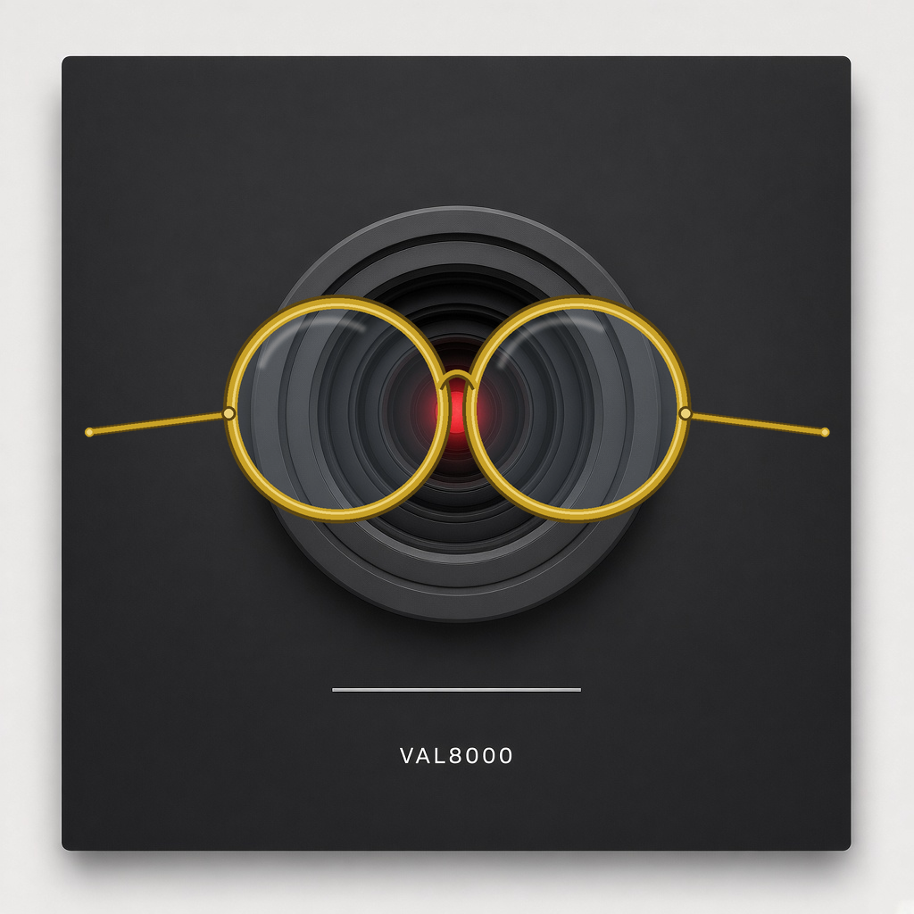
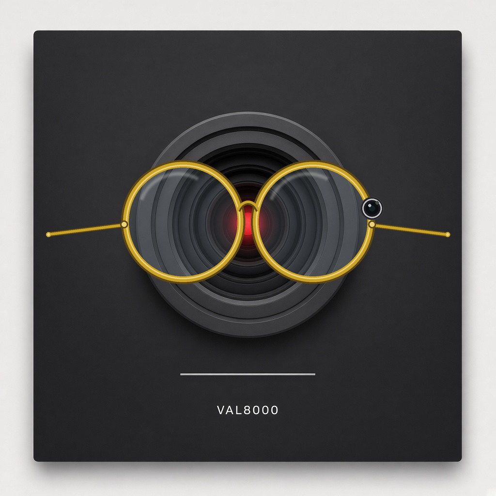
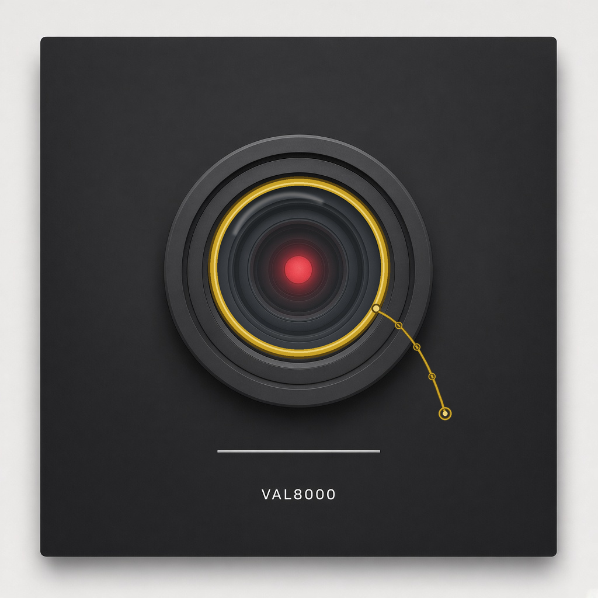

# VAL8000 skins — this is the drawer

This file is the drawer. Glasses, hats, pins, tessellation prints — they
live here. Not in the mouth PNGs. Not in the eye PNG.

Skins are **accessories**, like a seasonal logo hat. Same little square: red
circular lens on a dark panel. Same character. Public name **VAL8000**.

Default skin: the naked square.

Skins are accessories, not a new character.

**Default is the unadorned square.** Red eye, idle line, no accessory.
That is VAL8000 with nothing extra on. `naked` in the catalog is that
square.

Idle mouth stays a straight line under every skin.

He still types in the box. No TTS. No TTS this round. No stock voice. A
skin is clothes. It is not a new mouth, not a camera product, and not a
voice.

Catalog: [`assets/skins/skins.json`](assets/skins/skins.json).  
Overlays: [`assets/skins/`](assets/skins/).

## How to add a skin

1. Draw the accessory on a **1024×1024** PNG with a **transparent**
   background. Same box as the square. Only the thing he wears. No new
   face, no new mouth.
2. Drop the PNG (and an SVG if you have one) in [`assets/skins/`](assets/skins/).
3. Add a row to [`assets/skins/skins.json`](assets/skins/skins.json):
   - `id` — short name, no spaces (this is also `data-skin`)
   - `name` — what you see in the tray
   - `kind` — `glasses` | `hat` | `tessellation` | `pin` | `other`
   - `files` — the PNG / SVG. Default has none.
   - `notes` — anything the next person needs
   - keep `overlay` / `svg` / `title` / `when` if the clip-on script
     should know about it
4. Leave `naked` alone. Default has no files and `overlay` is null.
   That is the unadorned square.
5. If he should wear it in the widget: add the id to
   [`assets/val8000-skins.js`](assets/val8000-skins.js).

Hats and pins use the same steps. Same drawer.

If the skin is a tessellation print, drop the picture in
[`assets/skins/tessellation/`](assets/skins/tessellation/) first, then
point `files` at it.

Rebuild overlays with `python3 scripts/build_val8000_skins.py`.

## How to change

Clip-on for the always-in-the-view square (sibling widget HTML stays theirs):

1. Keep the face image as the idle line (`val8000-mouth-line.png`).
2. Add an empty `` on
   `.val8000-square`.
3. Include [`assets/val8000-skins.css`](assets/val8000-skins.css) and
   [`assets/val8000-skins.js`](assets/val8000-skins.js).
4. Set `data-skin` on `.val8000-square`, or call
   `VAL8000_applySkin(squareEl, "frequency")`.

How to change: set `data-skin`.

Masthead stays the naked square with the idle straight line. Accessories
are issue / night looks, not a second face.

| `data-skin` | Accessory | Overlay |
|---|---|---|
| `naked` (default) | none — unadorned square | — |
| `frequency` | tiny gold Frequency ribbon | [`skins/overlay-frequency.svg`](assets/skins/overlay-frequency.svg) |
| `weekend-update` | Weekend Update glasses | [`skins/overlay-weekend-update.svg`](assets/skins/overlay-weekend-update.svg) |
| `glasses-ordinary` | ordinary glasses on the square | [`skins/glasses-ordinary.svg`](assets/skins/glasses-ordinary.svg) |
| `glasses-camera` | glasses with a small camera on the frame | [`skins/glasses-camera.svg`](assets/skins/glasses-camera.svg) |
| `monocle` | one round gold lens on the red-eye square | [`skins/monocle.svg`](assets/skins/monocle.svg) |
| `issue1` | two red pills, both red | [`skins/overlay-issue1.svg`](assets/skins/overlay-issue1.svg) |
| `scientist` | scientist visor | [`skins/overlay-scientist.svg`](assets/skins/overlay-scientist.svg) |
| `music-art` | quiet music / art room pin | [`skins/overlay-music-art.svg`](assets/skins/overlay-music-art.svg) |
| `tessellation-tray` | empty slot for Jon’s tessellation prints | [`skins/tessellation/`](assets/skins/tessellation/) |

## Glasses in the drawer now

**Ordinary glasses.** Round gold frames on the square. Original drawing.
Not a brand. Not a product photo.

*Overlay:* [`assets/skins/glasses-ordinary.png`](assets/skins/glasses-ordinary.png)

**Camera-frame glasses.** Same frames, small camera on the rim. This is
a Meta Ray-Ban *analog* — the *idea* of a little camera on glasses — not
their product, not their logo, not a photo of the hardware. Accessory
only. Not a surveillance product. Not a keylogger. VAL still types in
the box.

*Overlay:* [`assets/skins/glasses-camera.png`](assets/skins/glasses-camera.png)

**Monocle.** One original round gold lens on the red-eye square. Same CG
gold family as the ordinary glasses. Not a brand. Not a product photo.
Monocle is a swap skin — good for Go deeper / sarcasm / Weekend Update scientist beat — not automatic on insult (insult is tongue).

*Overlay:* [`assets/skins/monocle.png`](assets/skins/monocle.png)

Weekend Update glasses stay in the tray too. Those are the thin joke
rims. Ordinary and camera-frame are the pair this drawer was opened for.
The monocle is the one-lens swap in the same gold family.

## Tessellation

Searched this repo for a tessellation / tesselation / tessellate /
kaleido app. **It is not in this repo.** The tray is empty on purpose.

Drop cool outputs from Jon’s tessellation app in
[`assets/skins/tessellation/`](assets/skins/tessellation/). Then they can
be worn like any other skin. Pretty patterns on the square. Not physics.
Not NAV-42. Not Fluid-Q. Not Q OS.

## Mouth still wins

Accessories sit **on** the square. They do not rewrite the mouth:

- Idle: straight line.
- After a normal answer: smile.
- Teeth: compliment, funny joke, or sarcasm. Never idle. Never masthead.

Do not edit those PNGs to add glasses. Drop an overlay in this drawer
instead.

## Legal fence (house)

- Original overlays. No film stills. No studio logos. No Google marks.
- Public name VAL8000. Do not print the other computer’s name as the
  character name.
- Do not put Meta or Ray-Ban logos on a skin. Do not ship a product photo
  of anyone else’s glasses.
- Do not call the camera-frame skin a camera product, a surveillance
  tool, or a keylogger.
- Do not revive NAV-42 / Fluid-Q / Q OS as physics so a pattern looks
  “deep.”
- Rebuild overlays with `python3 scripts/build_val8000_skins.py`.
