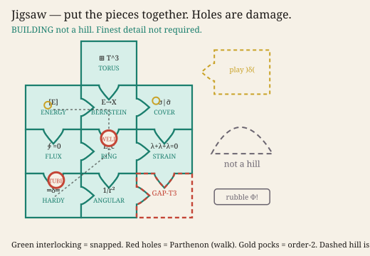
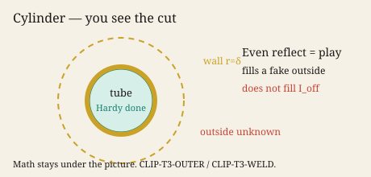
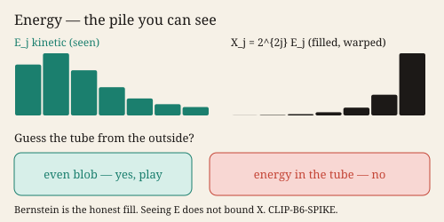
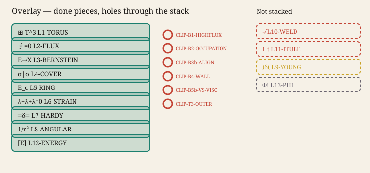
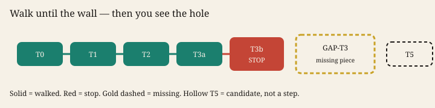

# See — pictures first, math under the fold

**Not a regularity proof.** Visual cognition is cheap. Inequalities are
expensive. This page is for a human to *see*. The store of record is
still git. CosmoEvolution is not this lab.

```bash
python -m domain_architect --see B
```

Open `see.html` in a browser. The same pictures sit here as SVG:

## Jigsaw

Literal interlocking pieces. Green snapped into a building. The gold
GOAL line is identification: named, plus how energy goes through it.
Finest detail is not required. Red holes are Parthenon damage (still a
building, not a hill). Gold pocks are order-2 texture. Dashed hill is
the wrong object.



## Cylinder

The wall is a cut. Green disk = Hardy, done. Gold ring = the wall.
Dashed outside = not Navier–Stokes.



## Energy

The pile you can see. Bernstein fills enstrophy and warps it. Guessing
the tube from the outside only works when the blob is even.



## Overlay

Done layers stacked like transparencies. Red rings are holes. Dashed
cards are not in the general shape.



## Gap

Walk the green steps. Stop at red. Gold dashed box = missing piece.
Hollow T5 = after, not walked.



Math and code stay attached (`--tube`, `--gap`, `--overlay`, `--energy-play`).
They are just not what you have to look at first.

The see-desk is the **visual appendage** of this package. Run any math
command and the banner on `see.html` adjusts. `--proceed` is the think
tank and does not move the picture. CosmoEvolution is still not this
desk. See [`14-PACKAGE.md`](14-PACKAGE.md).
