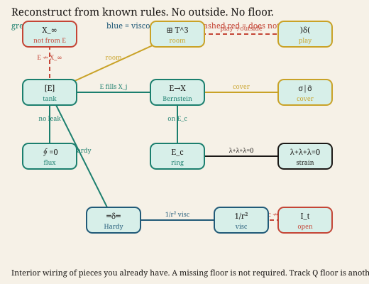

# Jigsaw — pieces, assembly, damage that does not unmake the building

Break the object into **literal jigsaw pieces**. Put the matching tabs
together. Holes that remain are either filled, or classified as second
order / third order and parked: they are **not identity**. You can still
tell a building from a hill after it has been shelled, or after
Parthenon-style decay. Finest detail is not required. The general shape
plus how energy moves through the snapped pieces is enough to name it.

## The goal

The bar is not finest detail. The bar is: **this is the object**, and
**this is how energy goes through it**. Crossing that line is
identification. It does not fill the walk and it is not smoothness.

```
Goal: OVER
  named = the identity shell is already in the catalog
  how   = [E] → E→X → ring → strain → Hardy → 1/r²
  fills_walk = false
```

The gold GOAL line on `see-jigsaw.svg` is that bar. Energy crosses it.
Red holes stay in the walls.

The assembler is a **constraint matcher** (same book, matching chart
tab, transposable). It is not a neural net. A statistical joiner would
silent-merge Q or Cosmo onto Track B because the letters rhyme.

Track B is the worked example. The method is general.

```bash
python -m domain_architect --jigsaw B
python -m domain_architect --jigsaw Q
```

The picture is `see-jigsaw.svg`. CosmoEvolution is not a piece.


## Reconstruct from known rules

You do not need the outside. You do not need a missing floor. Take every
rule you already have — energy flow, viscosity \(1/r^2\), traceless
strain, the torus as the room — draw the relationships, and reconstruct
from that interior wiring.



Green arrows are energy. Blue is viscosity. Dashed red is a known
**does not** (seeing \(E\) does not bound \(X_\infty\); \(1/r^2\) is not
domination of \(I_{\mathrm{tube}}\); even-reflect is not the outside).

A Track Q numeric floor is another book. Do not use it as the foundation
of this building.

## Pieces and tabs

Each overlay layer is a piece. The tab is the chart it lives on
(physical, frequency, vorticity, swirl, energy). Pieces snap only when
they are done **and** transposable **and** share a book and a tab.

Play pieces (even-reflect cylinder) stay loose. Refused pieces (`Φ_θ`)
stay rubble on the floor. They are not put back.

## Holes

| Order | Role | Identity? | Walk? | Example |
|---|---|---|---|---|
| 1 | Parthenon — shot through the walls | no | yes | `CLIP-T3-WELD`, `CLIP-T3-OUTER` |
| 2 | shell damage / graffiti | no | no | occupation, alignment, visc, spike |
| 3 | rubble | no | no | `CLIP-PHI-LINFTY` |

Order-1 holes still leave you certain it was a building. They block the
**walk**, not the name.

## Energy path

You do not need the outside or a missing floor to reconstruct. Known
rules among snapped pieces already say how it works:

```
[E] → E→X → E_c → strain → Hardy wall → angular 1/r²
```

That is enough to say what the object is. Identification is not
smoothness. Q onto B is `WRONG_OBJECT`. Cosmo onto B is `WRONG_OBJECT`.
