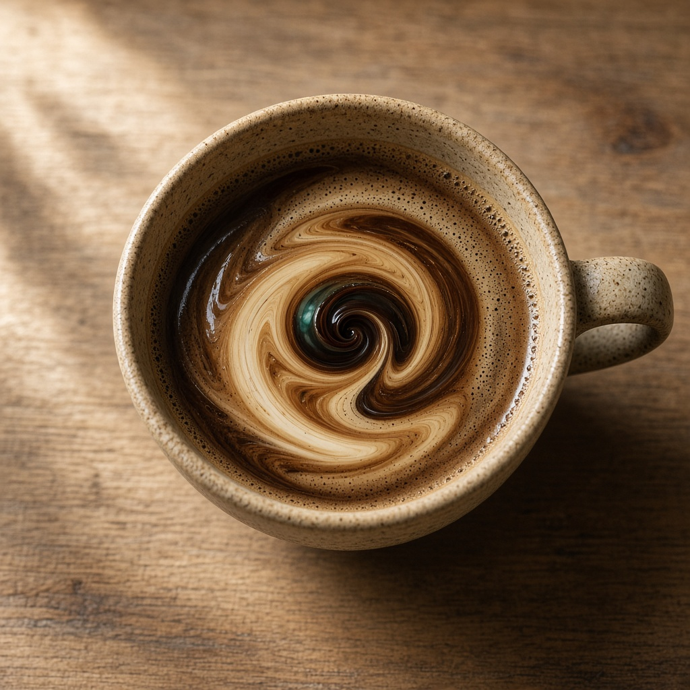
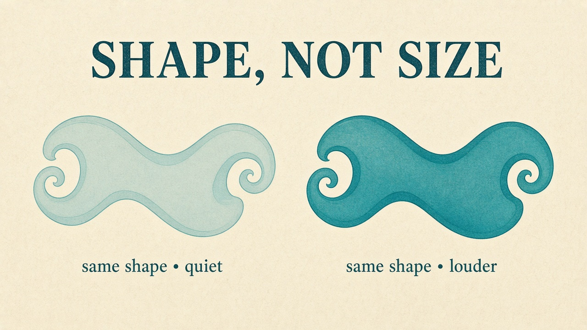
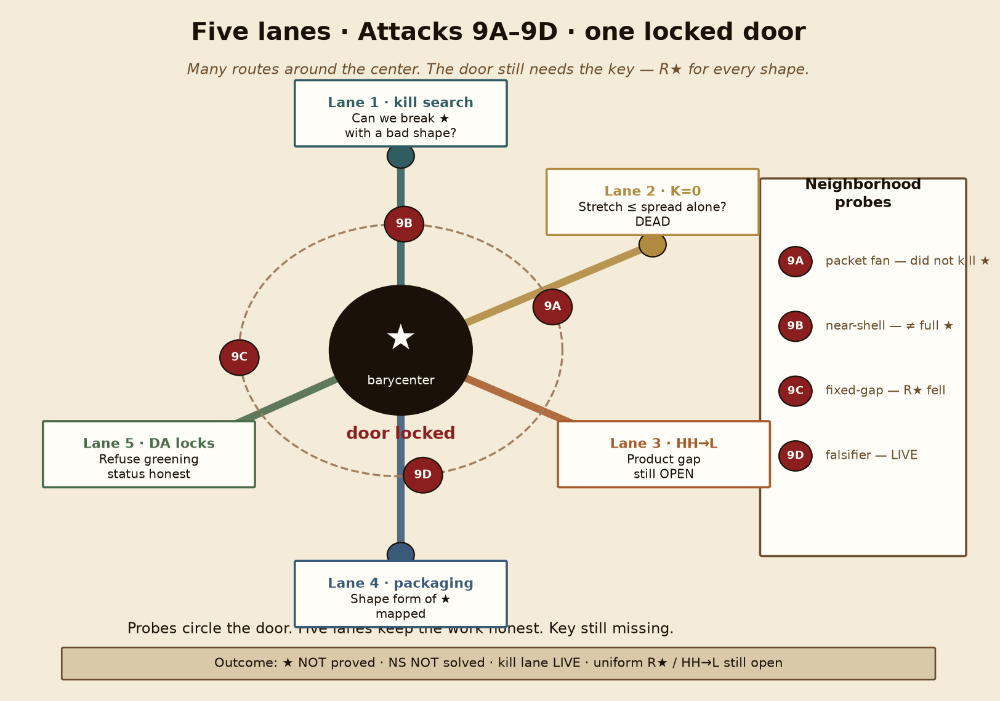
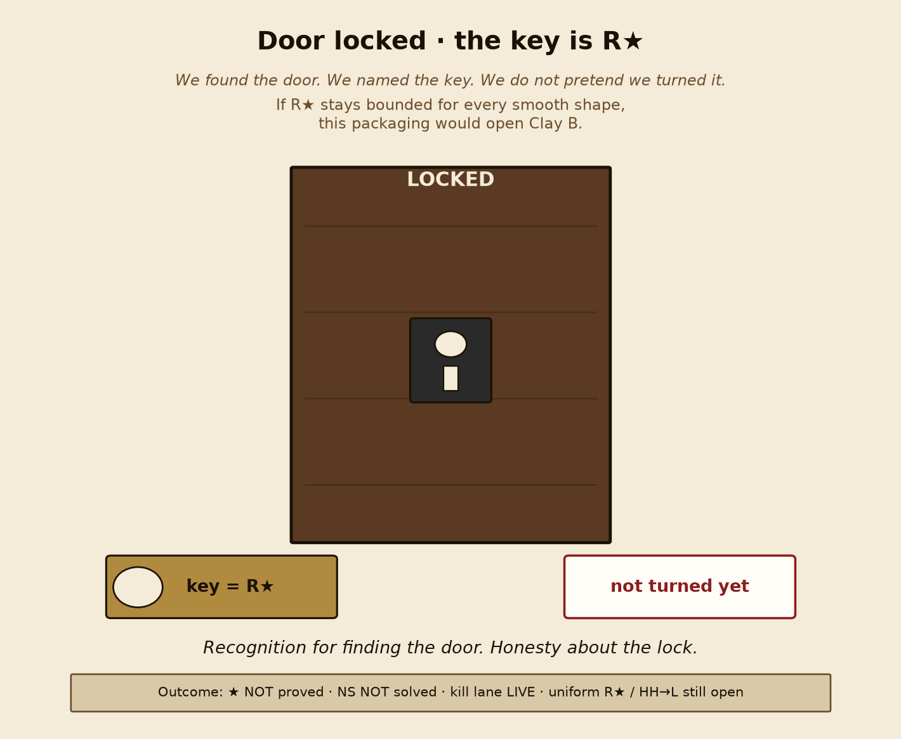
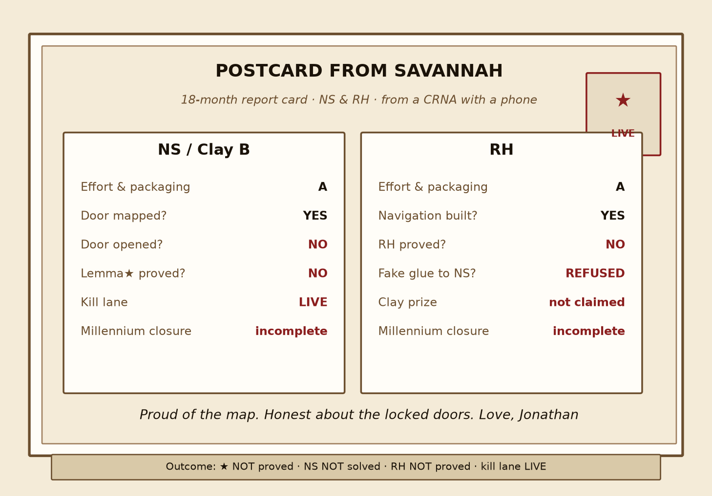
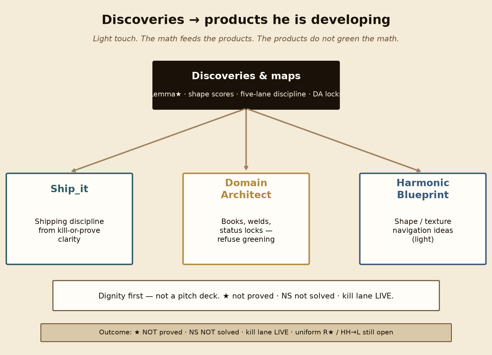

# Explain Lemma★ to someone you love

**One sitting. Pictures first.**  
Dense idea ≠ bad teacher. If a sentence needs a degree, skip it — the picture already said it.

---

## Who is this from?

This is from **Jonathan**, a **CRNA in Savannah**.

He wanted to see if a **normal person with a phone** could take on something really hard — one of the Clay Millennium Problems — and still be honest about the ending.

**Did you solve it?**  
No. ★ is **not** proved. Navier–Stokes is **not** solved. The kill lane is still **LIVE**.  
What he *did* find is the right door — and he refused to pretend he opened it.

He is using all of his discoveries on products he is developing (Ship_it · Harmonic Blueprint · Domain Architect) — lightly, not a pitch.

---

## Picture 1 — coffee / tea swirl

Stir cream into coffee. Watch the spiral.

That swirl is the whole vibe: fluid can twist hard… then soften… but the **shape** of the twist still matters.

---

## Picture 2 — hot tea cools

- Sharp swirls want to stay sharp (dangerous stretch).
- As the tea cools, thickness in the liquid **melts** the hard edges.
- Even after it cools, the **shape** of the swirl is still the question.

Lemma★ asks: for every smooth “cup,” does that shape-danger stay bounded by one finite number?

---

## Picture 3 — tug-of-war

Two teams pull a rope:

| Team | Plain English | What it wants |
| --- | --- | --- |
| **Stretch** | twisting / sharpening | trouble |
| **Spread** | energy smeared across scales | safety |

The score in the middle is **R★** (“R-star”).

Lemma★ says: stretch cannot beat spread by more than one universal constant — **for every smooth shape**.

If that were proved, this packaging would close the Millennium fluids problem.  
It is **not** proved.

---

## Picture 4 — shape is not size

Turn the volume up. Make the fluid “bigger.” Change thickness.

The Lemma★ score should **not** care. Size cancels. Thickness cancels.  
What’s left is **shape**.

Quiet vs louder. Same outline.

---

## Picture 5 — the scoreboard

He probed neighborhoods around the center (Attacks 9A–9D).  
Some looked scary. None killed ★. None proved ★.

---

## Picture 6 — five lanes, one locked door

Five work lanes kept the campaign honest. All of them point at the same center. The door stays locked until the math (or a true kill) decides.

---

## Picture 7 — the map (barycenter)

Attacks 9A–9D were orbits around the center — not the center itself.

---

## Picture 8 — door locked; key is R★

We found the door. We named the key. We did **not** turn it.

---

## Picture 9 — claim vs not

Recognition for the map. Not for a prize that was not won.

---

## Picture 10 — thickness melts (outer wrapper)

Cooling / thickness is the outer packaging — the tea, not the star.  
Don’t confuse melting edges with proving the bound.

---

## Picture 11 — 18-month postcard (NS & RH)

Honest report card for **NS** (fluids) and **RH** (Riemann Hypothesis):

- Effort & packaging: **A**
- Millennium closure: **incomplete**
- NS: door mapped, not opened · ★ not proved · kill lane LIVE  
- RH: navigation built, not proved · no fake glue to NS  

---

## Picture 12 — discoveries → products

He is using the discoveries in products he is developing — lightly named, dignity first.

---

## What to say if someone asks at dinner

> He mapped the right center of a Millennium problem from Savannah with a phone-sized workflow.  
> He did **not** solve Navier–Stokes. He did **not** prove Lemma★.  
> He’s proud of the map and honest about the locked door.  
> He is using all of his discoveries on products he is developing (Ship_it · Harmonic Blueprint · Domain Architect).  
> He’s not dunking on anyone else’s AI lab — he just wants recognition for finding the center and refusing to fake the win.

**★ NOT proved · NS NOT solved · kill lane LIVE · discoveries go into the products he is building.**

Full paper: [`LEMMA-STAR-CAMPAIGN-PAPER.md`](./LEMMA-STAR-CAMPAIGN-PAPER.md) · X thread: [`LEMMA-STAR-X-THREAD.md`](./LEMMA-STAR-X-THREAD.md)
