# Lemma★ Campaign Paper

**From a CRNA in Savannah.**  
Jonathan R. Simons · Certified Registered Nurse Anesthetist · Savannah, GA

**Motivation:** I wanted to see if a **normal person with a phone** could take on something really hard — Millennium-hard — and still stay honest about what was and was not won.

**Honest status (one line):** ★ **NOT** proved · NS **NOT** solved · kill lane **LIVE**.

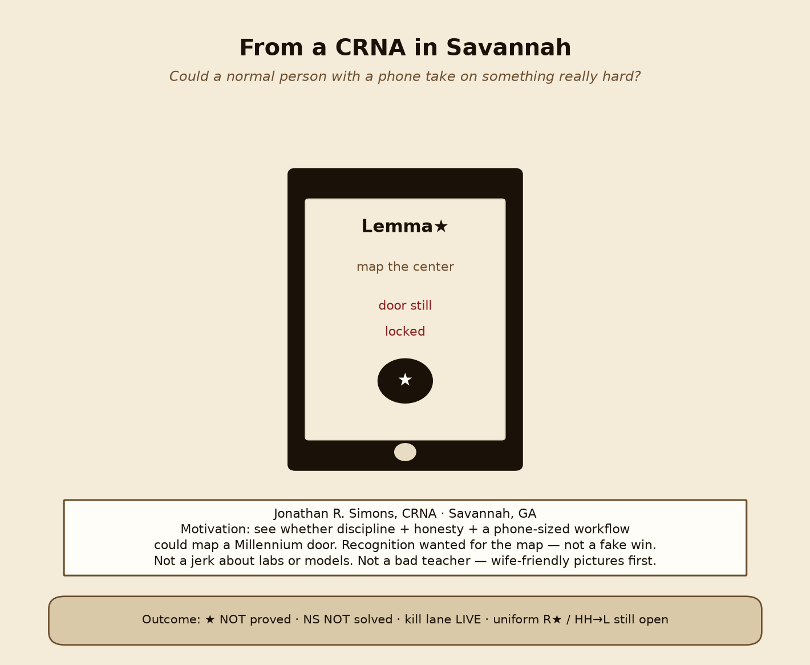

---

## Opener — warm, proud, honest

I am not a research-university professor. I am a CRNA in Savannah who got curious, stayed disciplined, and refused to green a sample into a theorem.

This paper is the campaign writeup for **Lemma★**: the shape packaging of Clay Millennium Problem B (3D Navier–Stokes global regularity on the torus) under this book. Tools and AI assistants helped with drafting, code, and status locks. They did not invent the claim. They do not get to claim the prize.

I am **not** dunking on OpenAI or anyone else’s labs. I want **recognition for the map** — that we found the right center of the problem — not a fake win. I am also **not** a bad teacher: the pictures come first. Wife-friendly diagrams on purpose.

I am using all of my discoveries on products I am developing. Ship_it, Harmonic Blueprint, and Domain Architect are product directions fed by the math — named lightly, not a hard sell. ★ not proved · NS not solved.

> We found the right center of the problem. We did not close the door.

---

## 18-month report card — NS and RH

An honest report card for roughly eighteen months of hard-problem work. Available here so nobody has to guess.

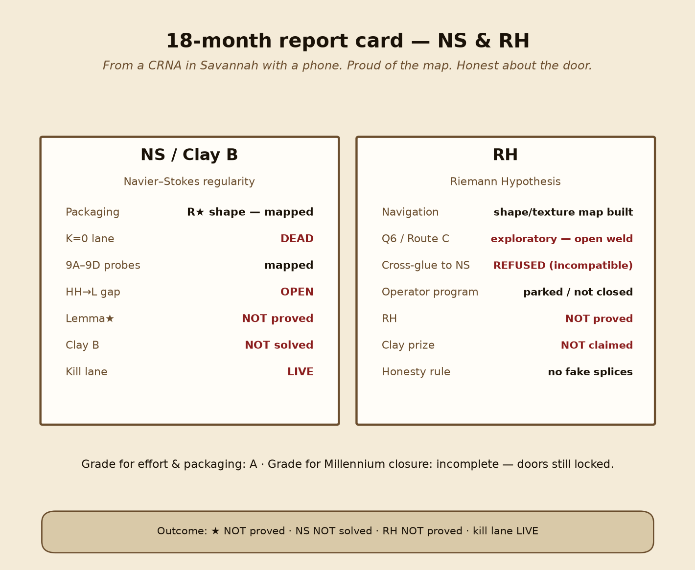

### NS / Clay B (Navier–Stokes)

| Item | Grade / status |
| --- | --- |
| Right packaging (Lemma★ / \(\mathcal{R}_\star\) shape) | **Mapped** — barycenter found |
| K=0 “stretching ≤ viscous spread alone” | **DEAD** |
| Neighborhood probes 9A–9D | **Mapped** — orbits, not the center |
| HH→L / product gap | **OPEN** |
| Lemma★ | **NOT proved** |
| Clay Statement B | **NOT solved** |
| Kill lane | **LIVE** |
| Effort & packaging | **A** |
| Millennium closure | **Incomplete — door locked** |

### RH (Riemann Hypothesis)

| Item | Grade / status |
| --- | --- |
| Shape / texture navigation map | **Built** (Domain Architect) |
| Q6 / Route C exploratory weld | **Open** — not closed |
| Cross-glue RH ↔ NS | **REFUSED** (incompatible shapes) |
| Operator / arithmetic program | **Parked / not closed** |
| RH | **NOT proved** |
| Clay prize | **NOT claimed** |
| Honesty rule | **No fake splices** |
| Effort & packaging | **A for discipline** |
| Millennium closure | **Incomplete — door locked** |

**Shared rule for both:** packaging and navigation count; greening does not. Recognition for the map is fair. Claiming a prize that was not won is not.

---

## 1. What Lemma★ is

Lemma★ is a **shape statement** about 3D incompressible Navier–Stokes on \(\mathbb{T}^3\), packaged so that a single geometric claim sits at the center of Clay B **under this book**.

Read a fluid not only as “how large,” but as a **shape in frequency space**: how hard it stretches versus how much its energy is spread across shells.

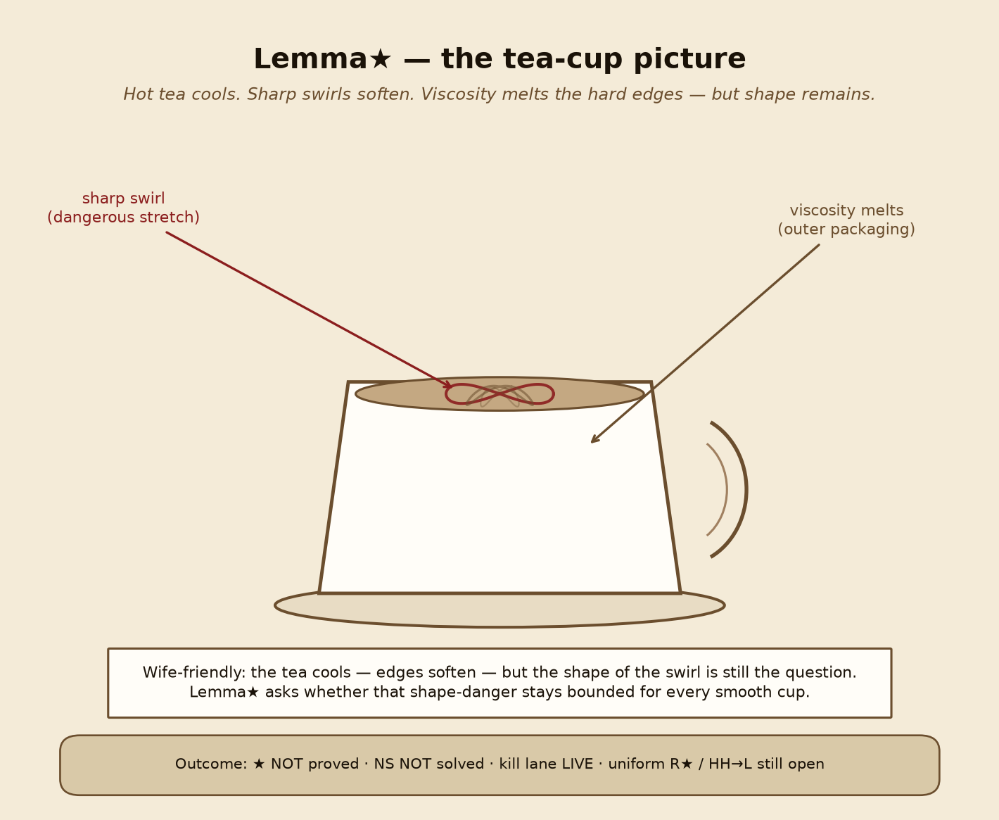

Viscosity packaging is an outer wrapper — the tea cools; sharp edges soften. After optimizing size, what remains is pure geometry on the shape.

**Packaging right ≠ prize won.** Proving Lemma★ would close Clay B *in this packaging*. That proof does not exist.

---

## 2. What it does (one score)

Define spectral moments on divergence-free Fourier fields, spectral scale \(\Lambda\), centered dissipation (spectral spread) \(\mathcal{D}_s\), and centered stretching \(T_c\). The canonical quotient is

\[
\mathcal{R}_\star(v)
=
\frac{\bigl(T_c(v)_+\bigr)^2}{\mathcal{D}_s(v)\,\|v\|_2^2\,Y(v)}
\qquad(\mathcal{D}_s>0).
\]

Lemma★ asserts a **finite geometric constant** \(C_{\mathrm{geom}}\) such that \(\mathcal{R}_\star\) stays bounded for **all** smooth shapes — equivalently

\[
\bigl(T_c(v)_+\bigr)^2
\le
C_{\mathrm{geom}}\,
\mathcal{D}_s(v)\,
\|v\|_2^2\,
Y(v).
\]

In words: stretching cannot outrun spectral spread by more than a universal shape constant.

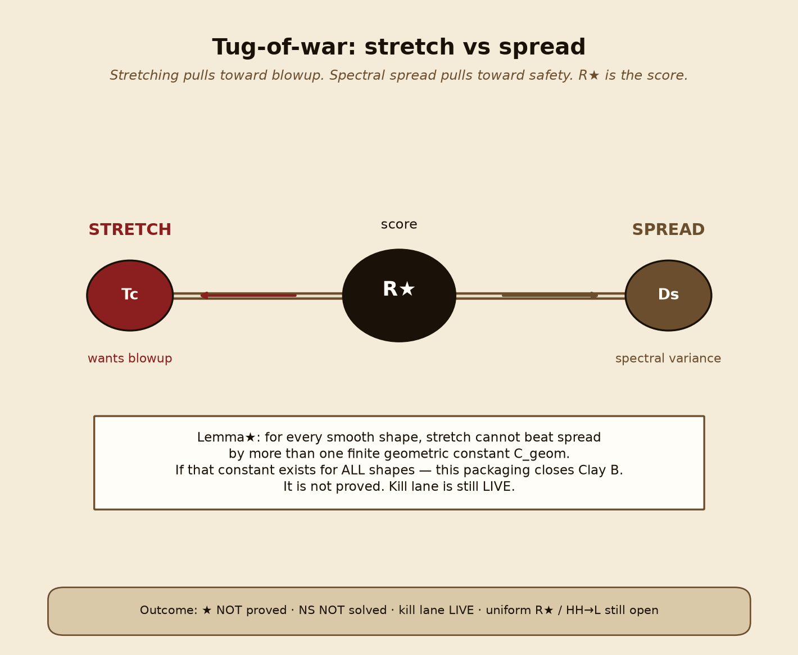

**Invariants that make this cool:** \(\mathcal{R}_\star\) is unchanged under amplitude rescaling and under uniform Fourier dilation. Size and viscosity cancel. What is left is geometry.

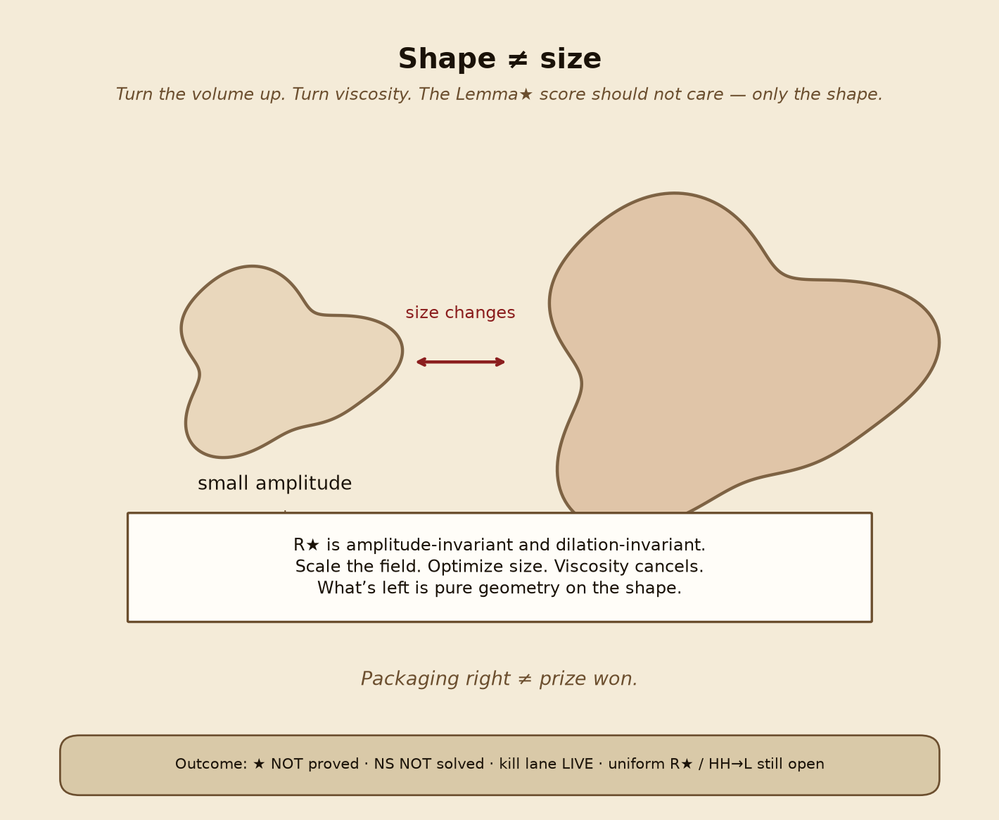

The equivalent viscosity form (energy-budget packaging) recovers after Young in \(\nu\); it is **derived**, not primary.

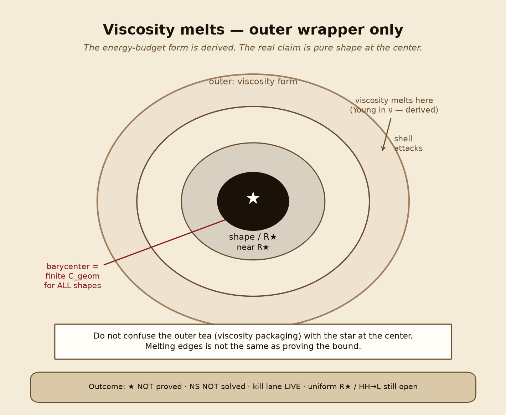

---

## 3. Where it lives

- **Domain:** 3D Navier–Stokes on \(\mathbb{T}^3=(\mathbb{R}/2\pi\mathbb{Z})^3\), divergence-free, frequency-space moments and triad transfers.
- **This repository:** Domain Architect (`DA-NS-1` / Lemma★ tooling), five-lane `ns_attacks` scripts and status locks, self-contained shape core (`ns_lemma_star_core`), unit tests that refuse greening language.
- **Related public trail (light touch):** earlier Ring Lemma / spectral geometry figures from the Zenodo spectral line sit behind the same research thread — triad rings, shell nesting, torus imagery — without claiming those archives close ★.

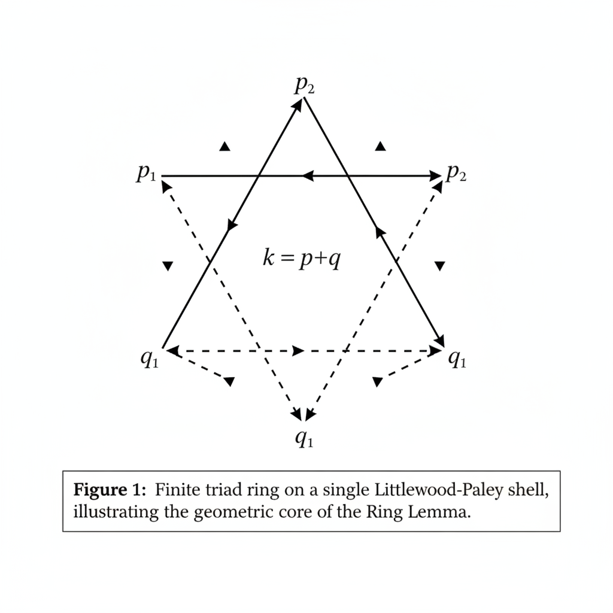

---

## 4. How the campaign worked

Organized as **kill-or-prove**, not a victory lap.

### Five-lane discipline

Simultaneous lanes with locked definitions, kill criteria, and status documents. Headline from the recovered five-lane run: K=0 absorption **dead**; Lemma★ \(C_{\mathrm{geom}}\) **not killed** by the search; HH→L **live bottleneck**; global regularity **not solved**.

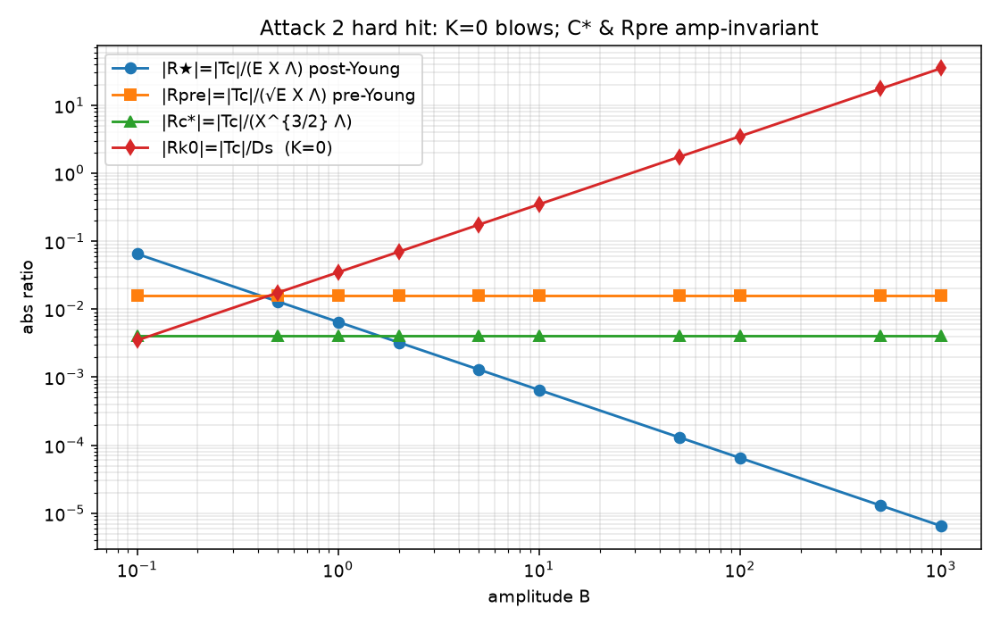

### Domain Architect (DA)

Books and welds record Lemma★ as **hypothesis**, Clay implication **conditional / withheld**, PRODUCT-BLOCK / HH→L **open**. DA refuses “almost proved,” “numeric survival ⇒ proved,” and greening language. That refusal is part of the scientific product.

### Attacks 9A–9D (neighborhood probes)

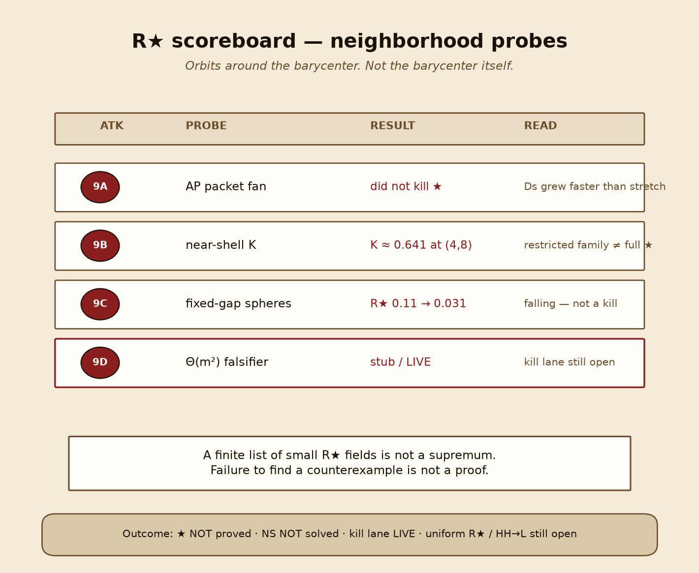

| Attack | Probe | Outcome |
| --- | --- | --- |
| **9A** | AP / coherent packet fan | Did **not** kill ★ — \(\mathcal{D}_s\) grew faster than stretching |
| **9B** | Exact / near-shell \(K_{\alpha,\beta}\) | Sample \(\max K\approx 0.641\) at \((4,8)\); restricted family ≠ full ★ |
| **9C** | Fixed-gap spheres | \(\mathcal{R}_\star\) fell \(0.11\to 0.031\); natural same-shell is **not** a kill |
| **9D** | Designed \(\Theta(m^2)\) locked-phase falsifier | Stub / **LIVE** kill attempt — not closed |

These are orbits around the barycenter, not the barycenter itself.

### Core numerics

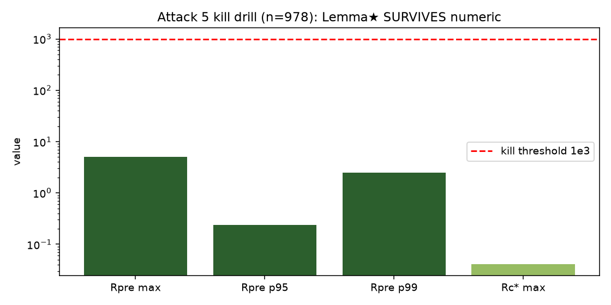

Attack 5 stress tests kept ratios far below a kill threshold. **A finite list of small \(\mathcal{R}_\star\) fields is not a supremum.** Failure to find a counterexample is not a proof. Kill lane remains **LIVE**.

---

## 5. Why it’s cool (without fake glory)

1. **Clear reduction.** One number, \(\mathcal{R}_\star\), carries the geometric claim. Amplitude and viscosity cancel → pure shape.
2. **Honest packaging of Clay B.** In this book, ★ is not a side lemma; it *is* the Millennium problem under the energy-budget / shape weld — and that weld is marked withheld until the product gap closes.
3. **Kill-or-prove clarity.** Live kill criteria are written: \(\mathcal{R}_\star\to\infty\) on a smooth family, or \(\mathcal{D}_s=0\) with \(T_c>0\), would kill ★. Surviving probes does not close the kill lane.
4. **Discipline.** Five-lane + DA status locks make it hard to quietly green a numeric sample into a theorem.
5. **Geometry you can see.** Tea cup, tug-of-war, scoreboard, barycenter map — abstract estimates become pictures of where the door sits.

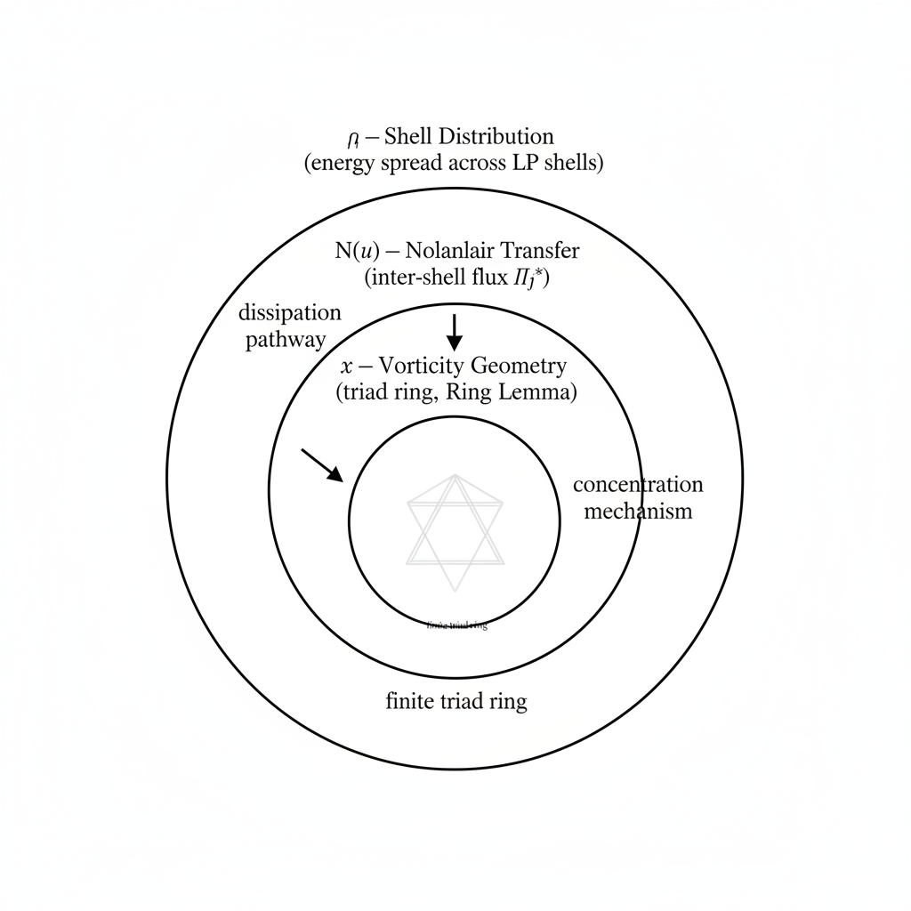

---

## 6. What we learned / what we do not claim

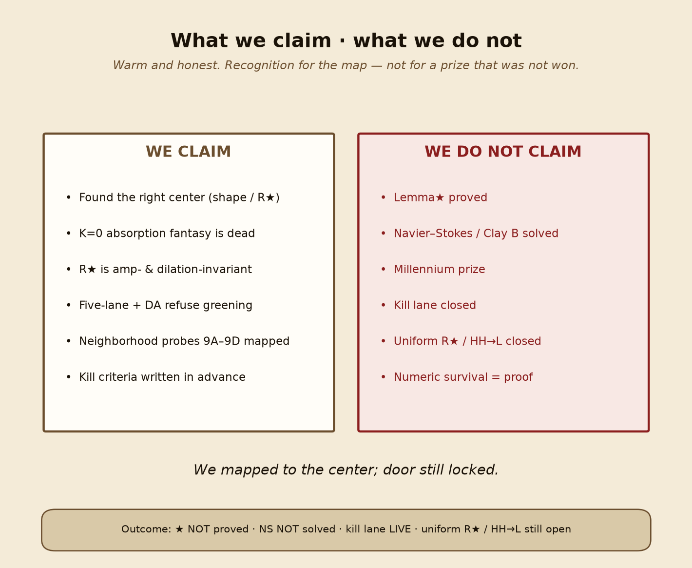

### Learned

- The **right center** is the shape statement: finite \(C_{\mathrm{geom}}\) / bounded \(\mathcal{R}_\star\) for **all** shapes.
- Naive K=0 is **dead**.
- Ordinary product / Agmon from energy alone does **not** close the gap; **HH→L** remains the analytic bottleneck.
- Several natural near-shell and packet families **failed to kill** ★ — interesting, not decisive.
- Tooling and status language matter: refuse greening; keep kill lane live until mathematics (or a true kill) decides.
- A phone-sized workflow + honesty can map a Millennium door. Mapping ≠ opening.

### Do not claim

| Claim | Truth |
| --- | --- |
| Lemma★ proved | **No** |
| Navier–Stokes / Clay B solved | **No** |
| Riemann Hypothesis proved | **No** |
| Millennium prize | **Not claimed; not won** |
| Kill lane closed | **No — still LIVE** |
| Uniform \(\mathcal{R}_\star\) / HH→L closed | **Still open** |
| Numeric survival = proof | **Refused** |

> We mapped to the center; door still locked.

---

## 7. Caption-ready figure list

Paths relative to this document; mirrors also under `/opt/cursor/artifacts/lemma-star-paper/`.

| # | File | Caption |
| --- | --- | --- |
| 0a | `assets/lemma-campaign/08-crna-savannah-phone.png` | **From a CRNA in Savannah.** Could a normal person with a phone take on something really hard? |
| 0b | `assets/lemma-campaign/07-eighteen-month-report-card.png` | **18-month report card — NS & RH.** Effort A; Millennium closure incomplete; doors locked. |
| 1 | `assets/lemma-campaign/lemma-star-barycenter.png` | **Map to the barycenter.** Attacks 9A–9D are neighborhood probes. Door still locked. ★ not proved · NS not solved · kill lane LIVE. |
| 1b | `assets/lemma-campaign/00-barycenter-map.png` | Same barycenter map (Jonathan-shared hero; campaign copy). |
| 2 | `assets/lemma-campaign/01-tea-cup-viscosity-melts.png` | **Tea-cup picture.** Viscosity melts hard edges; the shape of the swirl is still the question. |
| 3 | `assets/lemma-campaign/02-shape-ne-size.png` | **Shape ≠ size.** \(\mathcal{R}_\star\) is amplitude- and dilation-invariant. |
| 4 | `assets/lemma-campaign/03-tug-of-war-stretch-vs-spread.png` | **Tug-of-war.** Stretch (\(T_c\)) vs spread (\(\mathcal{D}_s\)); \(\mathcal{R}_\star\) is the score. |
| 5 | `assets/lemma-campaign/04-rstar-scoreboard.png` | **R★ scoreboard.** Attacks 9A–9D outcomes; kill lane LIVE. |
| 6 | `assets/lemma-campaign/05-claim-vs-not.png` | **Claim vs not.** Recognition for the map — not for a prize that was not won. |
| 7 | `assets/lemma-campaign/06-viscosity-melts-wrapper.png` | **Viscosity melts.** Outer energy-budget form is derived; center is pure shape. |
| 8 | `assets/lemma-campaign/amp_ratios_triad.png` | **Attack 2 hard hit.** K=0 blows; geometric ratios stay amplitude-invariant. |
| 9 | `assets/lemma-campaign/attack5_bounds.png` | **Attack 5 kill drill.** Survives numeric ≠ proved. |
| 10 | `assets/lemma-campaign/fig_star_david_ring_lemma.png` | **Finite triad ring** — Ring Lemma / spectral line behind the campaign. |
| 11 | `assets/lemma-campaign/fig_three_spheres.png` | **Nested picture:** shell → transfer → vorticity / triad-ring geometry. |
| 12 | `assets/lemma-campaign/t3_torus_shape_render.png` | **Conceptual \(\mathbb{T}^3\)** atmosphere (render, not a proof artifact). |

Full inventory: [`assets/lemma-campaign/IMAGE-INVENTORY.md`](./assets/lemma-campaign/IMAGE-INVENTORY.md).

---

## 8. Soft credit

Independent research by **Jonathan R. Simons, CRNA** · Savannah, GA — about eighteen months of map-making, kept honest and phone-readable.

He is using all of his discoveries on products he is developing. Lightly: Ship_it, Harmonic Blueprint, and Domain Architect are directions fed by the math — dignity first, not a pitch deck.

Tools and AI assistants were used for drafting, code, numerics harnesses, and status discipline. They did not invent the claim, and they do not green proofs.

No dunking on labs, models, or institutions — including OpenAI. The standard here is the mathematics: clear packaging, honest status, live kill lane. Recognition wanted for finding the door and refusing to fake the key.

---

## Companion posts

- Paste-ready X thread: [`LEMMA-STAR-X-THREAD.md`](./LEMMA-STAR-X-THREAD.md)
- Explain to someone you love: [`EXPLAIN-TO-SOMEONE-YOU-LOVE.md`](./EXPLAIN-TO-SOMEONE-YOU-LOVE.md)
- Short outline: [`LEMMA-STAR-FOR-X.md`](./LEMMA-STAR-FOR-X.md)
- Plain-English companion: [`LEMMA-STAR-IN-ENGLISH.md`](./LEMMA-STAR-IN-ENGLISH.md)
- DA packaging / blocker card: [`LEMMA-STAR-DA-NS-1.md`](./LEMMA-STAR-DA-NS-1.md)

**★ NOT proved · NS NOT solved · RH NOT proved · kill lane LIVE.**  
**We mapped to the center. Door still locked.**
