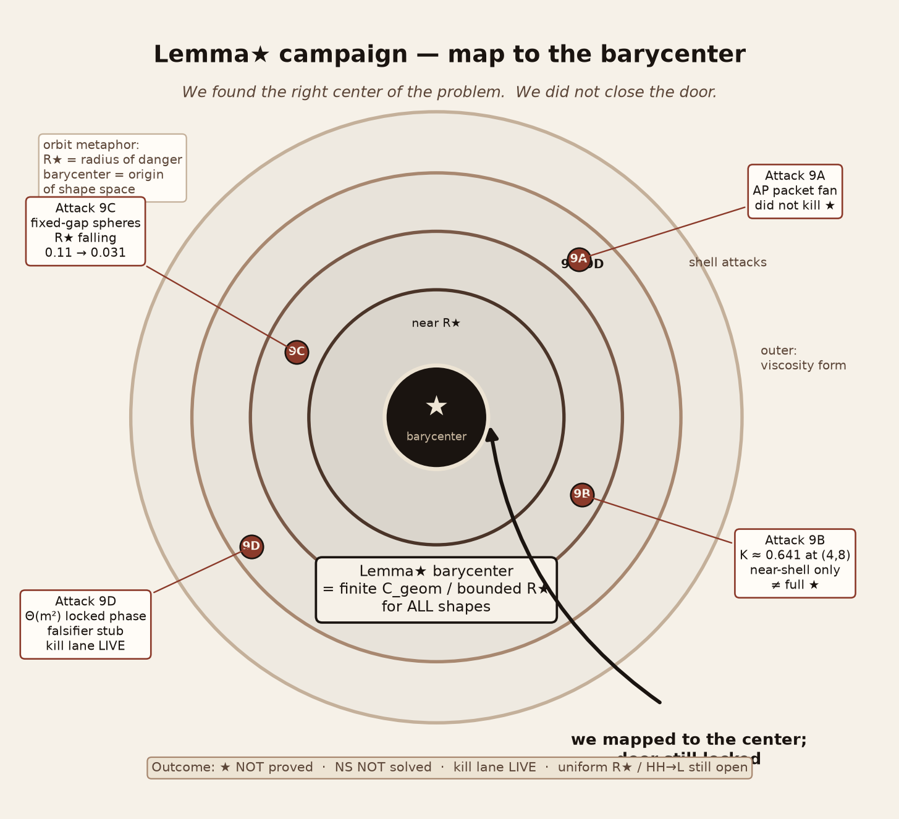
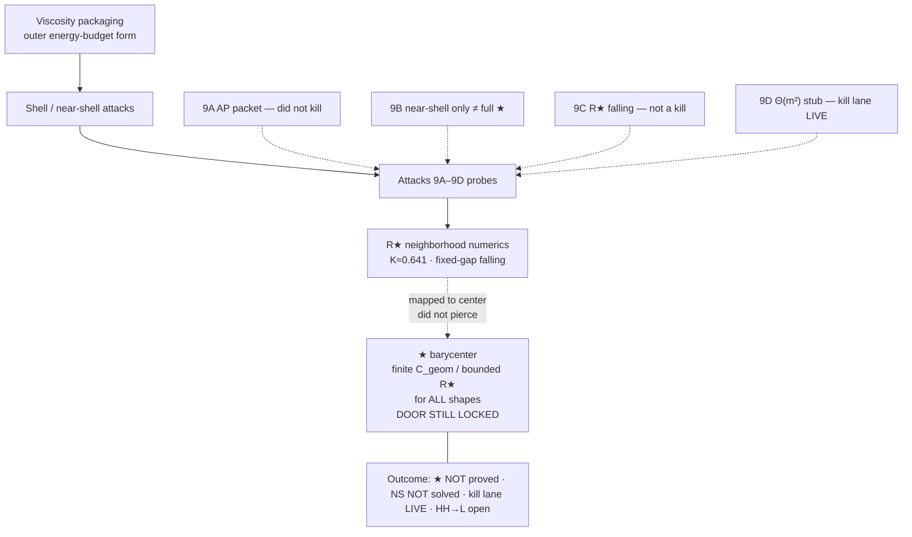

# Lemma★ in English

**Audience:** Jonathan (plain English)  
**Lock:** ★ is **NOT** proved. Navier–Stokes is **NOT** solved. Kill lane is still **LIVE**.

Artifact copy: `/opt/cursor/artifacts/lemma-star-barycenter.png`

---

## What Lemma★ is trying to say

Imagine a 3D fluid as a shape in Fourier space — not just “how big,” but “how stretched” versus “how spread out.”

- **Stretching** tries to make the flow blow up (the dangerous term \(T_c\)).
- **Spectral spread** is how much the energy sits off a single shell (the variance \(D_s\)).

Lemma★ says: for every smooth shape, stretching cannot outrun spectral spread by more than a **finite geometric constant**. In one number:

\[
\mathcal{R}_\star
=
\frac{(T_c)_+^2}{D_s\,\|v\|_2^2\,Y}
\quad\text{should stay bounded for all shapes.}
\]

That boundedness is exactly “finite \(C_{\mathrm{geom}}\) / bounded \(R_\star\) for **all** shapes.” That is the barycenter.

Viscosity packaging is the outer wrapper. The real claim is pure **shape**.

---

## Why it matters

In this book’s packaging, proving Lemma★ is how you package Clay Statement B (3D Navier–Stokes global regularity on the torus). If ★ holds, the dangerous spectral scale cannot blow up in finite time → enstrophy stays finite → no blowup.

So Lemma★ is not a side lemma. It is the Millennium problem **under this packaging**. Packaging right ≠ prize won.

---

## What the campaign actually did

1. **Five-lane** — organized attack lanes (definitions, kill criteria, status locks) instead of one muddy thread.
2. **\(R_\star\) / shape form** — locked the exact quotient and invariants (amplitude and uniform dilation cancel). Core code and unit tests pin the formulas.
3. **Attacks 9A–9D** — probes into neighborhoods of the center:
   - **9A** AP packet fan — did not kill ★ (\(D_s\) grew faster than stretching).
   - **9B** exact/near-shell \(K_{\alpha,\beta}\) — max \(K\approx 0.641\) at \((4,8)\); restricted family only, **not** full ★.
   - **9C** fixed-gap spheres — \(R_\star\) fell \(0.11\to 0.031\); natural same-shell is not a kill.
   - **9D** designed \(\Theta(m^2)\) locked-phase falsifier — stub / LIVE kill attempt, not closed.
4. **Status archive + core code** — SoT docs, refusal language (“almost proved” is refused), and self-contained shape helpers so nobody can quietly green a numeric sample into a proof.

---

## Honest outcome

| Claim | Truth |
| --- | --- |
| Lemma★ proved? | **No** |
| NS solved? | **No** |
| Kill lane closed? | **No — still LIVE** |
| Uniform \(R_\star\) / HH→L closed? | **Still open** |

Numerics probed neighborhoods. A finite list of small \(R_\star\) fields is not a supremum. Failure to find a counterexample is not a proof.

---

## Did we get close to the barycenter?

**Yes — we found the right center. No — we did not close it.**

The barycenter is the shape statement itself: finite \(C_{\mathrm{geom}}\) / bounded \(R_\star\) for **all** shapes. Getting the packaging and the map right is real progress. Piercing the door (a uniform bound, or a true kill via HH→L structure) did not happen.

\(K\approx 0.641\) and falling fixed-gap ratios are orbits around that center, not the center itself.

> We mapped to the center; door still locked.

---

## Picture (Mermaid)

---

**NS not solved. Lemma★ open.**
